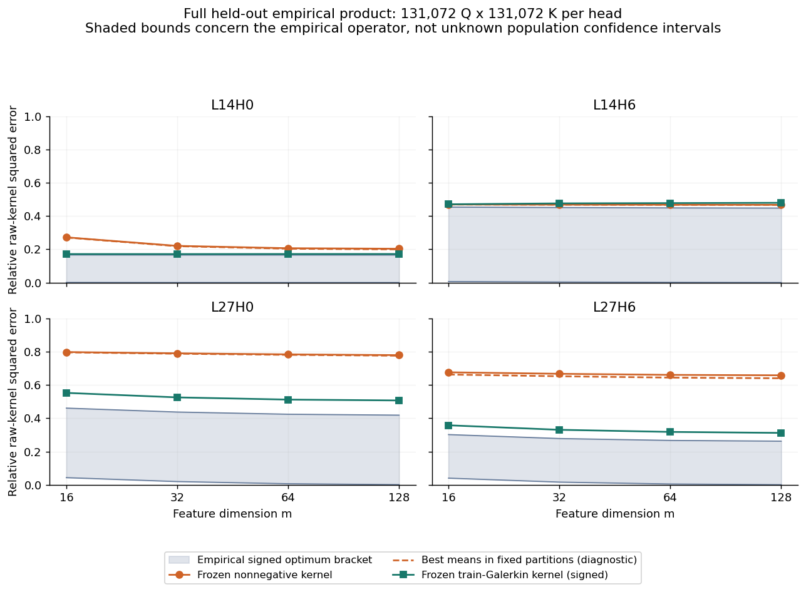
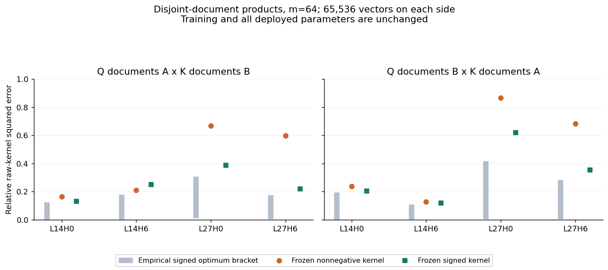
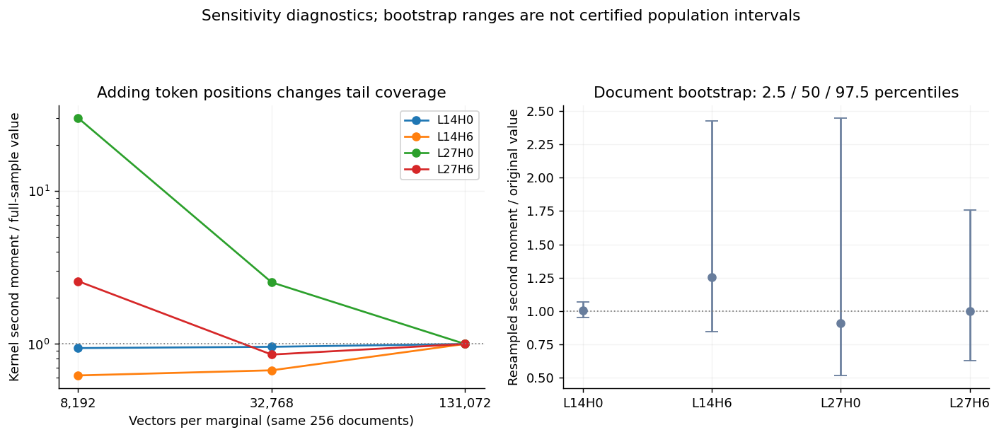

后续更新：更紧的完整经验谱界和完整模型 4/336-head 部署验证见[部署与谱界报告](../deployment_validation/REPORT.zh.md)；与 FAVOR+、SDERF/ADERF 的同协议 kernel 比较见[比较报告](../kernel_comparison/REPORT.zh.md)。下面保留本轮算子推导与分布诊断的原始结论范围。

本轮结论：**用户对有限矩阵NMF和此前FAVOR变体的质疑成立。现在已完成从总体算子出发的非FAVOR条件期望kernel推导，并做了完整留出经验乘积分布及不相交文档验证。但尚未验证“covariance准确预测真实总体谱”“正kernel接近最优rank-m下界”这两个核心经验主张。当前正kernel的主要问题是分区表达误差。**

本报告对应`distribution_operator`目录的新实验。以前的Gaussian、有限矩阵NMF、神经特征实验保留在各自目录；它们不与本轮不同采样口径的结果混为一张方法优劣表。

**目标始终是未归一化kernel。** 定义

$$\kappa(q,k)=\exp(q^\top k/\sqrt{128}),\qquad
\mathcal R(\hat\kappa)=\frac{\mathbb E[(\kappa-\hat\kappa)^2]}{\mathbb E[\kappa^2]}.$$

所有表中误差均为这个相对平方误差；分母是总体或经验kernel二阶矩，不是attention行归一化。计算只用一个训练确定的head常数做数值缩放，随后恢复原始kernel幅度。没有截断logit、调低temperature、删除极端Q/K或用归一化attention作为拟合标签。另存广义KL/总kernel质量作为辅助指标。

**总体对象已经重新定义。** 对真实文档及位置采样机制诱导的P_Q、P_K，定义T:L²(P_K)→L²(P_Q)，(Tf)(q)=E_K[κ(q,K)f(K)]。H=Eκ²有限时，Schmidt展开和最优rank-m谱尾定理成立。正特征最优值则为

$$E_m^+=\inf_{f_r,g_r\ge0}\mathbb E\left[\left(\kappa(Q,K)-\sum_{r=1}^m f_r(Q)g_r(K)\right)^2\right]\ge E_m^\star.$$

有限矩阵NMF的数值解给出该矩阵非负最优误差的可行上界，不能替代这个总体函数优化问题。固定权重Qwen的pre-RMSNorm、有限线性投影及保范数RoPE使Q/K有界，所以一般Hilbert–Schmidt框架适用；拟合Gaussian模型的二阶矩发散并不表示真实kernel发散。

决定总体谱的关系是

$$ (TT^*)(q,q')=M_K((q+q')/\sqrt d),\qquad
M_K(t)=\mathbb E e^{t^\top K}.$$

非零特征值为σ_j²。完整矩母函数及另一侧分布决定谱，covariance通常不够。本轮用有界离散分布构造了精确反例：所有分布均值0、方差0.2，最优rank-1相对误差却分别为0.03750、0.14970、约0.5；二阶矩可从1.0811变为1.1769×10¹³。相同covariance的Gaussian surrogate甚至满足a<1/2。这不是采样误差，而是精确加权算子SVD及解析二阶矩同时验证的不可识别性反例。公式、适用条件和证明见[THEORY.zh.md](THEORY.zh.md)。

**新kernel由条件期望投影构造。** 单侧理想形式为

$$\boxed{\kappa_C^+(q,k)=\sum_{r=1}^m\mathbf1_{C_r}(q)
\underbrace{\mathbb E[\kappa(Q,k)\mid Q\in C_r]}_{M_{Q\mid C_r}(k/\sqrt d)}.}$$

它自动非负、rank≤m。把Schmidt展开代入L²条件期望投影，得到

$$E_m^\star\le R_C\le E_m^\star+
\underbrace{\sum_{j\le m}\sigma_j^2\mathbb E\operatorname{Var}(u_j(Q)\mid C)}_{D_Q^{(m)}}.$$

这给出明确的设计原则：让分区在加权谱坐标(σ₁u₁,…,σ_m u_m)内的量化误差小。只有D_Q相对谱尾足够小，才能推出接近最优。低rank本身不保证m个分区满足这个条件。条件期望的L²投影性质是经典事实；谱学习中的经验算子与总体算子近似也需要独立统计条件。[条件期望讲义](https://adembo.su.domains/stat-310b/lnotes.pdf)、[Rosasco等：积分算子学习](https://jmlr.org/papers/v11/rosasco10a.html)。

本轮实际实现两侧分区，使推理不必显式平均训练Q参考点：

$$\boxed{\hat\kappa_m^+(q,k)=e_{c(q)}^\top\hat B e_{d(k)},\quad
b_{rs}=\mathbb E[\kappa(Q,K)\mid Q\in C_r,K\in D_s].}$$

特征取φ_Q(q)=e_c(q)、φ_K(k)=B e_d(k)，维度仍是m；B有m²个系数。Q侧非负且稀疏，K侧严格为正。默认不使用严格正平滑。两侧实际形式的条件保证为

$$R_{CD}\le2E_m^\star+D_Q^{(m)}+D_K^{(m)},\qquad
R(\hat\kappa_m^+)=R_{CD}+\sum_{rs}p_rq_s(\hat b_{rs}-b_{rs})^2.$$

后一式精确分离了分区表达误差和均值估计偏差。当前没有证明或验证前一式中D_Q、D_K相对谱尾很小，也不能把条件性的(2+ε)倍保证当成已实现的结果。

这不是对FAVOR辅助高斯积分改节点或改权重：积分分布是实际Q|C_r，Q侧是分区指示函数，实际部署是两侧分区查表。此前的指数节点方法则确实属于FAVOR/DERF相关方法族。[FAVOR# / DERF原始论文](https://proceedings.neurips.cc/paper_files/paper/2023/file/02dec8877fb7c6aa9a79f81661baca7c-Paper-Conference.pdf)。这里仍然使用经典条件期望、谱分区和Nyström思想，不能仅凭“非FAVOR”声称新颖性。

在固定cell内，广义KL的最优常数也是条件均值，因为∂E D_I(κ∥b)/∂b=1−Eκ/b。因此，本轮直接积分估计均值，既是该函数类的KL最优参数，也是L²投影参数；没有用MSE做神经训练，也没有重复epoch。统计积分会组合同一向量与多个另一侧向量，不能把这些组合称为独立训练样本。

**数据与训练/诊断边界。** 冻结Qwen/Qwen2.5-1.5B，revision为`8faed761d45a263340a0528343f099c05c9a4323`，复用真实投影、RoPE后的BF16 Q/K，head为L14H0、L14H6、L27H0、L27H6，d=128。全部kernel计算和算子累积使用Float64。

| 用途 | 文档 | 每侧向量 | 参数用途 |
|---|---:|---:|---|
| 校准训练 | 2,048 | 65,536 | 锚点、谱坐标字典、分区 |
| 独立moment-fit训练 | 2,048 | 65,536 | 条件均值B、有符号训练Galerkin核心 |
| 内部留出 | 256 | 131,072 | 固定函数风险和经验算子诊断 |
| 官方测试子集 | 20 | 10,240 | 跨来源固定函数风险和诊断 |
| 不相交文档A→B | 128+128 | 每侧65,536 | 固定函数风险和诊断 |
| 不相交文档B→A | 同上反向 | 每侧65,536 | 固定函数风险和诊断 |

内部留出来自WikiText103源train按文档划分；官方子集是以前固定的20个WikiText2 test文章前缀，不是完整官方测试集。训练和内部/官方测试token哈希无重叠。两个训练用途的文档完全不相交。所有输入长度为1024；Q边缘使用后512位置，K边缘使用前512位置；每个训练文档每侧抽32位置，内部测试用全512位置。定义的乘积分布不同于实际同文档因果配对联合分布。

从校准数据每侧抽1,024个锚点，构造原始kernel并SVD。用前256个加权Nyström延拓函数作算子字典；分区用其中前64个加权谱坐标。贪心轴向切分每次降低谱坐标的组内平方误差，最小叶节点32个校准向量；先产生256细分叶节点，保存m=16/32/64/128的嵌套切分。该算法不是全局最优谱量化。

B在独立moment-fit数据完整65,536²乘积上求cell均值。所有报告rank均无空训练cell，所有系数正值。完整内部测试每个head计算131,072²=17,179,869,184个raw kernel值，4个head共68,719,476,736个，分块累积，无需存储整张矩阵。

这个覆盖范围是**全部已收集留出向量的经验边缘乘积分布**，并非未知真实总体。约687亿配对是高度复用向量的组合，不能据此认为有687亿独立样本；采样不确定性仍主要受文档数量与未见尾部控制。

**算子区间代替小矩阵NMF“下界”。** 在固定训练函数字典的子空间内，按评价测度正交化并计算压缩C，记其奇异值s_j，则

$$\boxed{\frac{\sum_{j>m}s_j^2}{H}\le\frac{E_m^\star}{H}
\le1-\frac{\sum_{j\le m}s_j^2}{H}.}$$

左端来自压缩奇异值不超过总体奇异值；右端来自一个实际可行rank-m投影。区间宽度是1−∥C∥²_F/H，明确记录了字典未捕获的能量。测试压缩只作诊断，其参数没有进入部署kernel。以下区间是对完整经验测度的数值区间，未包含总体采样置信误差。

另做了完全训练确定的有符号Galerkin–Schmidt对照：在moment-fit训练分布正交化字典、计算C_train并rank-m截断，得到固定m维函数，再评估未见文档。这比仅在1,024锚点矩阵上截断并求逆更能检验“训练积分算子→新输入函数”的路径，但仍不保证非负或总体最优。

**完整内部留出结果，m=64。**

| head | 经验最优有符号rank-64区间 | 冻结有符号训练Galerkin | 冻结新正kernel | 分区表达误差 | 均值估计偏差 |
|---|---:|---:|---:|---:|---:|
| L14H0 | [0.00004479, 0.165681] | 0.171722 | 0.206549 | 0.203375 | 0.003175 |
| L14H6 | [0.00128578, 0.448789] | 0.477636 | 0.467656 | 0.467362 | 0.000294 |
| L27H0 | [0.00667760, 0.424443] | 0.512328 | 0.784200 | 0.781123 | 0.003077 |
| L27H6 | [0.00511808, 0.266917] | 0.318085 | 0.660848 | 0.644438 | 0.016410 |

分区表达误差按留出测度的精确cell均值计算，是固定分区内最优风险；它不参与训练。表中“均值估计偏差”是相对留出条件均值的偏差，含有限训练样本误差和分布差异，不能全归因于某种独立同分布估计方差。后三列满足严格Pythagoras分解。

即使允许用留出数据最优设置当前B，误差仍为0.203、0.467、0.781、0.644；因此在当前函数类内增加数据主要消除的小项并非主要瓶颈。这个结果支持改进谱表示、分区或条件函数表达，不能推断所有非负kernel都具有同样的误差。

对于L27H6，E*≤0.266917H而R=0.660848H，所以R/E*至少约2.48；L27H0至少约1.85。即使区间仍宽，也足以排除当前构造已经达到接近1倍的rank-m最优误差。该比较针对有符号最优值；非负类自身的最优值仍未确定。

| head | m=16正kernel | m=32 | m=64 | m=128 |
|---|---:|---:|---:|---:|
| L14H0 | 0.271894 | 0.220544 | 0.206549 | 0.203282 |
| L14H6 | 0.469303 | 0.468157 | 0.467656 | 0.467280 |
| L27H0 | 0.798092 | 0.790541 | 0.784200 | 0.779600 |
| L27H6 | 0.676441 | 0.667498 | 0.660848 | 0.658415 |

完整精确数值以[curves.csv](curves.csv)为准。增加m对部分head帮助很小；训练字典之外的kernel能量同样没有消失。字典维度64→128→256时，未捕获能量分别为：L14H0 0.1734→0.1674→0.1656；L14H6 0.4573→0.4531→0.4475；L27H0 0.4930→0.4540→0.4178；L27H6 0.3219→0.2895→0.2618。不能把这些宽区间当作精确总体下界估计。



**官方20文档子集与此前小矩阵的差异。**

| head | m=64经验有符号最优区间 | 冻结有符号训练Galerkin | 冻结新正kernel |
|---|---:|---:|---:|
| L14H0 | [0.00014561, 0.199363] | 0.219683 | 0.254134 |
| L14H6 | [0.00018182, 0.840880] | 0.942688 | 0.945591 |
| L27H0 | [0.00410125, 0.243082] | 0.383822 | 0.687913 |
| L27H6 | [0.00111440, 0.170075] | 0.237139 | 0.598735 |

同一官方Q/K来源池，旧L14H0的4张512点产品矩阵NMF m=64报告误差约1.556×10⁻⁵；现在完整10,240×10,240经验乘积的有符号最优误差下界已达1.456×10⁻⁴，约为旧值的9.36倍。旧结果是抽样子矩阵各自拟合后的汇总，并不代表一个函数覆盖整个池的误差。扩大到全池后，连更宽松有符号类的下界都高于旧NMF误差，这直接显示了原有替代的局限。没有把旧FAVOR或旧神经特征的不同配对测试误差搬来充当本轮同协议对照。

**不相交文档验证。** 完整经验乘积允许Q和K来自同一原始文档。虽然这类pair只占1/256=0.390625%，L14H6中却贡献36.3036%的kernel平方能量。因此另将256留出文档随机分成A、B各128篇，计算Q_A×K_B及Q_B×K_A的全512位置乘积，保证两侧没有同文档配对，训练函数及系数不变。

| head | A→B最优有符号区间 | A→B新正kernel | B→A最优有符号区间 | B→A新正kernel |
|---|---:|---:|---:|---:|
| L14H0 | [0.00004879, 0.123664] | 0.164811 | [0.00004275, 0.194741] | 0.237966 |
| L14H6 | [0.00168295, 0.180255] | 0.209981 | [0.00122311, 0.107643] | 0.125994 |
| L27H0 | [0.01012888, 0.307473] | 0.668047 | [0.00343635, 0.416914] | 0.865141 |
| L27H6 | [0.00545303, 0.176336] | 0.597908 | [0.00378266, 0.282251] | 0.683465 |

两个方向是两个不同经验乘积测度，不能平均区间端点后称为总体置信区间。L14H6误差明显改变，L27H0两方向也差异很大，说明文档组成和尾部覆盖对问题定义及结论影响显著。单纯从同池矩阵中屏蔽同文档pair会形成非乘积联合测度，不能直接对它套原产品测度的Schmidt下界；使用不相交两组边缘保留了乘积分布结构。



**样本规模与尾部诊断。** 内部8,192、32,768、131,072的嵌套规模都覆盖全部256文档，变化的是每文档采样位置数。L27H0的log Eκ²为15.8508→13.3748→12.4454；最小样本二阶矩约是全量的30.1倍。样本增加可能稀释一次罕见大值的经验权重，不能预设误差或能量必须单调增加。

以文档为单位bootstrap 2,000次，同时对两侧施加相同重采样文档权重，得到二阶矩相对原样本的2.5%—97.5%描述区间：L14H0 [0.955,1.068]，L14H6 [0.845,2.424]，L27H0 [0.519,2.447]，L27H6 [0.627,1.757]。L27H0删除一篇特定文档即可令二阶矩降到0.629倍。bootstrap无法可靠覆盖尚未观测的尾部，也不是总体谱区间证明。

这些诊断补充了此前“最大0.1%贡献极高平方能量”的现象：指数kernel二阶矩对尾部、文档关联及位置抽样非常敏感。之前0.1%的具体百分比属于之前的paired样本，不能直接沿用为本轮全产品的百分比。本轮没有把减少平方损失敏感性等同于改变理论目标；二阶谱尾仍然对应原始kernel的L²风险。



**哪些理论成立，哪些尚未成立。** 一般Schmidt谱尾、条件期望误差分解、压缩谱区间是有明确条件的数学结论，本轮证明和数值检查均支持实现正确。Gaussian闭式谱在Gaussian且max a_i<1/2时成立，原16-head实验仅4个符合HS条件，12个不适用；有效head的总体相对谱排序也未达到原Go标准。该公式没有被验证为真实LLM总体谱预测器，新的同covariance反例进一步说明不能省略分布假设。

从有限经验算子推广到真正总体，需要对H和压缩C及Gram估计误差给出有效界；仅有HS有限性不能保证当前样本量下的精度。本轮提供了完整经验积分、嵌套规模、官方子集、不相交文档及文档敏感性检查，但未得到紧的总体置信界。因此“已验证理论框架”只能用于数学结构与数值实现，不能用于“总体谱预测准确和正特征近最优”的合并主张。

**Go / No-Go判断。** 原“只用covariance→Gaussian总体谱→接近下界正kernel”的完整主线仍是No-Go；当前分区正kernel作为接近最优方法也未过关。继续研究“真实分布算子→可泛化谱表示→正函数逼近”有数学依据，但主要未解决问题已经明确为字典未捕获能量、谱分区/条件函数表达及总体尾部估计。KAN只能作为其中一种参数化方式；本轮没有证明KAN独占优势，也没有新增KAN、mulKAN与MLP的公平比较。若接回两层KAN，需要保持此前等参数、独立文档和非MSE训练协议，并为分区软化/条件函数逼近增加明确误差项。

这轮结果足以纠正研究对象并建立可复核实验，但不足以支持顶会方法结论。更有价值的贡献需来自新的分布假设下可用的谱/统计界、接近最优的正函数构造条件，或在严格同协议强基线上稳定实现优势。当前实现还依赖1,024锚点谱坐标计算与m²查表参数，没有测端到端LLM推理速度、全模型替换或困惑度；m维线性汇总结构并不自动等于实用加速。

**实现检查与复现。** [checks/aggregate_audit.json](checks/aggregate_audit.json)记录176组谱区间检查、320组固定函数风险下界检查、176组嵌套分区投影检查均通过；最大相对Pythagoras残差1.21×10⁻¹⁵，训练Galerkin投影恒等式误差6.39×10⁻¹⁵。独立小算子检查覆盖流式积分与直接矩阵一致、真正有限SVD尾在上下界中、条件均值KL驻点和非负因子分解。部署特征乘积与直接查表的相对偏差低于4.3×10⁻¹⁶。

已有数据缓存下，可在本目录运行以下命令复现计算和图表。`run.py`会复用已存在的本轮算子缓存；修改协议后应使用新输出目录，不能混用旧缓存。

```bash
/root/autodl-tmp/conda-envs/nonlinear-qk/bin/python verify.py
/root/autodl-tmp/conda-envs/nonlinear-qk/bin/python run.py
/root/autodl-tmp/conda-envs/nonlinear-qk/bin/python cross_docs.py
/root/autodl-tmp/conda-envs/nonlinear-qk/bin/python diagnostics.py
/root/autodl-tmp/conda-envs/nonlinear-qk/bin/python covariance_counterexample.py
/root/autodl-tmp/conda-envs/nonlinear-qk/bin/python train_galerkin.py
/root/autodl-tmp/conda-envs/nonlinear-qk/bin/python kernel.py
/root/miniconda3/bin/python summarize.py
```

[kernel.py](kernel.py)提供`ConditionalMeanKernel(m=64)`，输入shape为`[4, n, 128]`，head顺序由`protocol.json`固定，`features(x,'q'/'k')`返回`[4,n,m]`非负特征。`results/`保留训练参数、抽样文档索引、全部算子矩、分区及逐尺度结果，`curves.csv`与`summary.json`给出紧凑汇总。图表同时保存PNG和PDF。
