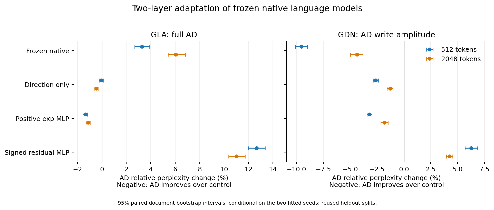

**幅度—方向结构接入原生 GLA / Gated DeltaNet：局部适配实验**

2026-09-08。本轮完成16次训练、两种子、完整模型困惑度评价、真实缓存解码、显式递推与分布理论适用边界核查。结论：GDN的独立写入幅度对照有收益，但尚不能证明AD优于一般同预算适配；GLA上直接正特征替换没有超过原模型。

这次测的是“AD参数化结构在预训练原生门控模型中重新学习”的可行性。不是把既有Qwen上的AD权重跨模型搬入，也不是继续用exp(qᵀk/√d)作为原生GLA/GDN的训练标签。原生模型不以该softmax kernel为既有机制，所以冻结主体、仅以下一token交叉熵训练新增分支。这个目标切换必须与原主线的原始kernel拟合结果区分。

**范围与公平比较**

| 项目 | GLA | Gated DeltaNet |
|---|---:|---:|
| 实际原模型参数 | 341,707,776 | 357,781,928 |
| 原生层数 | 24 | 21 |
| 修改层（从0计） | 11、23 | 10、20 |
| 每层修改heads | 全部4个 | 全部4个 |
| feature / key维度m | 128 | 256 |
| 每head新增登记参数 | 98,304 | 196,608 |
| 两层新增登记参数 | 786,432 | 1,572,864 |
| 主要新增矩阵乘 FLOPs/token | 1,572,864 | 3,145,728 |

所有适配器均为独立Q/K、无偏置、d→192→m的两层SiLU MLP。m保持原生状态宽度，保留原衰减、输出门、V投影、短卷积及归一化。FLOPs按一次乘加=2计，上表只计新增MLP矩阵乘；激活、归一化、逐点幅度乘法另有O(m+d_v)开销，模型公共部分未计入新增量。

数据：1,024篇训练文档各512token，共524,288token，每次拟合只用一遍；32篇验证；64篇512token及16篇2,048token测试。文档来自既有划分，经共同tokenizer重编码；训练/验证/测试原文hash和token hash不重复。它们不是本轮新收集的盲测文档，也没有新域测试或数万token长上下文测试。

每方法seed11、29，batch4、256次更新，AdamW lr=0.001，cosine末端0.0001，weight decay=0.0001，clip=1。使用最终检查点，无确认集选点或选种子。主比较与补充控制登记参数、数据、文档顺序、更新数一致。登记参数相等不等于全部分支都可识别：方向消融、原生L2以及RMSNorm会消去或弱化部分幅度自由度。

残差MLP为f_X(x)=x+MLP_X(x)，它保留原生带符号几何且初始化更接近原模型。此强控制在主结果部分可见后追加，属于探索性机制检查；不是与正AD相同的初始函数。因此当前结果也不能区分全部初始化、优化难度与最终表达能力。

模型：[GLA checkpoint](https://huggingface.co/fla-hub/gla-340M-15B)、[GDN checkpoint](https://huggingface.co/puigde/gated-deltanet-360M-15B-slimpajama)。确切revision、环境版本和数据hash在checks及summary.json。首次候选GDN检查点因权重布局不兼容，在训练前弃用，错误与替换过程保存在协议；实际使用的两模型均零缺失/多余/不匹配权重。

**实际接入形式**

令z_X=W₂,X SiLU(W₁,X standardized(x))∈R^m，π_X=softmax([z_X,1:m−1,0])，a_X=exp(4tanh(z_X,m/4))。

GLA完整AD使用f_X=√m a_Xπ_X：

$$S_t=D_tS_{t-1}+f_K(k_t)v_t^\top,\qquad o_t=f_Q(q_t)^\top S_t.$$

方向消融令a_Q=a_K=1。正指数MLP控制为exp(4tanh(z_X/4))/√m，具有相同两层矩阵尺寸。这里的控制不是Hedgehog或FAVOR+原论文实现。

GDN直接把上述AD输入原生Q/K L2归一化，正幅度完全消去。为让幅度真正起作用，写入方案令u=π_K/||π_K||₂、r=π_Q/||π_Q||₂，并采用：

$$\boxed{S_t=\alpha_t(I-\beta_tu_tu_t^\top)S_{t-1}+\beta_t a_K(k_t)u_tv_t^\top,\qquad o_t=r(q_t)^\top S_t.}$$

实现为方向送入原生Q/K归一化，V→a_KV，保留alpha和beta。它是AD的稳定写入扩展，不能再叫原始正kernel加标准linear-attention分母。两个原生模型仍使用各自输出归一化，不额外引入softmax attention分母。

**完整模型PPL；只替换两层，越低越好**

下表为两种子的算术平均±样本标准差；原模型未训练，只有一个固定结果。两模型的绝对PPL不能用来判定架构排名，因为预训练配置与数据不同。

| 模型 | 方法 | 512token | 2048token |
|---|---|---:|---:|
| GLA | 冻结原模型 | 16.01072 | 17.43497 |
| GLA | AD 方向消融 | 16.54511 ± 0.02715 | 18.57573 ± 0.00615 |
| GLA | AD 完整特征 | 16.53492 ± 0.00676 | 18.49160 ± 0.00315 |
| GLA | 同参数正指数 MLP | 16.76497 ± 0.01300 | 18.70428 ± 0.02645 |
| GLA | 同参数带符号残差 MLP | 14.67527 ± 0.04129 | 16.65899 ± 0.00770 |
| GDN | 冻结原模型 | 14.74034 | 15.63878 |
| GDN | AD + 原生 L2（幅度消去） | 13.69574 ± 0.00632 | 15.15213 ± 0.00752 |
| GDN | AD 独立写入幅度 | 13.33647 ± 0.00582 | 14.95613 ± 0.00768 |
| GDN | 同参数正指数 MLP | 13.77786 ± 0.00423 | 15.23072 ± 0.00465 |
| GDN | 同参数带符号残差 MLP | 12.55069 ± 0.02232 | 14.34615 ± 0.01020 |

GLA：AD相对原模型PPL升高3.27% / 6.06%；虽优于正指数MLP，仍落后于带符号残差MLP。幅度相对方向消融在512token几乎无增益，2048token只有约0.45%改善。

GDN：AD写入相对原模型PPL降低9.52% / 4.37%，相对幅度被归一化消去的版本降低2.62% / 1.29%，相对正指数MLP降低3.20% / 1.80%。但相对同参数残差MLP，PPL仍高6.26% / 4.25%。因此“有任务适配收益”和“AD具有独特优势”是不同主张；本轮只支持前者及正方向条件下的写入幅度增益。

**配对文档统计**

先对两种子的每篇NLL取平均，再做20,000次配对文档bootstrap。区间仅条件于这些已拟合检查点和当前文档集，不覆盖训练种子不确定性、总体最优界或新域泛化。表中为AD相对控制的PPL百分比变化，负数代表AD更好；基于平均NLL的比值，与PPL算术均值的比值可能有极小差别。

| 模型 | AD比较对象 | 512token，变化% [95%区间] | 2048token，变化% [95%区间] |
|---|---|---:|---:|
| GLA | 冻结原模型 | +3.27 [+2.68, +3.90] | +6.06 [+5.41, +6.82] |
| GLA | AD 方向消融 | -0.06 [-0.24, +0.11] | -0.45 [-0.58, -0.33] |
| GLA | 同参数正指数 MLP | -1.37 [-1.56, -1.19] | -1.14 [-1.30, -0.97] |
| GLA | 同参数带符号残差 MLP | +12.67 [+12.01, +13.37] | +11.00 [+10.38, +11.72] |
| GDN | 冻结原模型 | -9.52 [-10.09, -8.97] | -4.37 [-4.98, -3.81] |
| GDN | AD + 原生 L2（幅度消去） | -2.62 [-2.86, -2.39] | -1.29 [-1.58, -1.02] |
| GDN | 同参数正指数 MLP | -3.20 [-3.44, -2.97] | -1.80 [-2.14, -1.48] |
| GDN | 同参数带符号残差 MLP | +6.26 [+5.69, +6.87] | +4.25 [+3.95, +4.55] |

**理论检查：哪些性质能迁移**

GLA展开后的序列权重为f_Q(q_t)ᵀ[∏_{u=j+1}^tD_u]f_K(k_j)。标量门D_u=α_uI且两方法共享门路径时，d_I(wκ,wh)=w d_I(κ,h)，可在同一个序列抽样测度上转移风险。逐通道门则依赖特征与门控的坐标对应，只有静态kernel的SVD谱和误差不足以控制它。原生GLA的输出RMSNorm还会消去正Q幅度（eps=0精确，实际近似）。这是对[GLA递推](https://arxiv.org/html/2312.06635v2)的接入分析。

GDN的归一化删除幅度；若绕过L2直接使用a_Ku，擦除转移沿u的特征值为α(1−βa_K²)，可能扩张。上述写入扩展保留单位key与擦除beta，因此状态转移仍非扩张。有限幅度只限制每步注入，alpha可趋近1时不能因此声称状态范数有长度无关的绝对上界。这些推导基于[Gated DeltaNet递推](https://arxiv.org/html/2412.06464v1#S3.SS1)。

更强的反例：两组严格为正的单位特征，即使拥有完全相同的完整query-key矩阵，也能产生不同的GDN输出。令两时刻q=(1,1,1)/√3；A的两个key都为u=(2,1,1)/√6，B的key为u与u'=(1,2,1)/√6。query-key矩阵全部等于c=4/√18，但key-key内积为1或5/6。取alpha=beta=1、v=[1,0]，第二次读出分别为0与c/6≈0.157135。这个反例在单位范数条件下成立，不能由保留原生L2来消除。

因此研究GDN需要序列分布P_seq上的读出风险，并纳入key-key几何、擦除、写入。THEORY.zh.md给出共同门/值路径下的方向与幅度扰动界。它是充分界，不是rank-m最优误差，也没有在本轮验证“接近总体Schmidt下界”。GDN的等效权重还可带符号，原始正kernel的I误差分解不能原样用于完整序列算子。

**机制诊断及其限度**

8篇heldout文档、两层、seed11，在固定原生Q/K输入上提取每篇128个key，统计单位key的平均非对角余弦。随后把相同keys用于读写，配独立随机V，alpha=beta=1作一次写入后回读；这项合成关联记忆测量只隔离几何，使用平方误差作评价，并非MSE训练，也不是原生门下的LM检索任务。

| 模型 | 方法 | key平均余弦 | 合成回读NMSE |
|---|---|---:|---:|
| GLA | 冻结原模型 | 0.6627 | 1.5465 |
| GLA | AD 方向消融 | 0.5689 | 1.8274 |
| GLA | AD 完整特征 | 0.6474 | 1.8329 |
| GLA | 同参数正指数 MLP | 0.7192 | 1.8919 |
| GLA | 同参数带符号残差 MLP | 0.6380 | 1.5481 |
| GDN | 冻结原模型 | 0.2583 | 1.0439 |
| GDN | AD + 原生 L2（幅度消去） | 0.8204 | 1.8799 |
| GDN | AD 独立写入幅度 | 0.8273 | 1.8683 |
| GDN | 同参数正指数 MLP | 0.8439 | 1.8965 |
| GDN | 同参数带符号残差 MLP | 0.3428 | 1.4668 |

GDN的AD keys明显更集中，余弦从原生约0.258变为0.827，合成回读也较差。这支持“key几何改变可能增加干扰”的解释，但不能把差距全部归因于正性；有限训练、近均匀初始化及特征坐标迁移也可能参与。残差MLP的合成回读同样弱于原生，尽管PPL更好，进一步说明这项诊断不等价于语言模型质量。

所有方案最终验证损失仍在下降，因此并未证明收敛或固有表达上限。当前负面结果是固定单遍预算下的局部迁移结果，不是从头预训练的架构No-Go。

**速度与固定状态**

RTX3090，batch1，原模型BF16、适配器FP32，TF32关闭，无推理autocast；训练时使用BF16 autocast。真实FLA chunk预填充及fused recurrent解码，512token预填充+16token固定真实延续；所有方法热身后同一进程内五轮循环平衡执行顺序。以下为各项墙钟时间中位数；没有CUDA Graph或新增特征融合算子。初始3轮计时也完整保留，优先用此平衡顺序测量。小于约几个百分点的方法间差距不能作为GPU适配性优越的证据。

| 模型 | 方法 | 512token预填充ms | 解码ms/token | 实际缓存MiB |
|---|---|---:|---:|---:|
| GLA | 冻结原模型 | 36.15 | 28.50 | 12.000 |
| GLA | AD 方向消融 | 37.87 | 29.80 | 12.000 |
| GLA | AD 完整特征 | 38.34 | 30.22 | 12.000 |
| GLA | 同参数正指数 MLP | 37.70 | 30.27 | 12.000 |
| GLA | 同参数带符号残差 MLP | 37.65 | 29.64 | 12.000 |
| GDN | 冻结原模型 | 55.91 | 31.91 | 21.492 |
| GDN | AD + 原生 L2（幅度消去） | 57.80 | 33.21 | 21.492 |
| GDN | AD 独立写入幅度 | 57.55 | 33.41 | 21.492 |
| GDN | 同参数正指数 MLP | 57.22 | 32.88 | 21.492 |
| GDN | 同参数带符号残差 MLP | 57.23 | 32.82 | 21.492 |

AD的两层接入使当前完整模型耗时增加约3%–6%，没有推理速度收益。新增MLP算术量小，但单token路径增加若干小矩阵乘、非线性、转换和Python/算子调用；本轮不把参考实现时间当作最优融合实现的成本。幅度乘法可以与已有处理融合，无法因此保证总体更快。

两模型原本就使用固定状态，本轮m不变，缓存也不变。GLA为12MiB；GDN为21MiB递推矩阵加约0.492MiB短卷积状态。新增适配器FP32权重另占约3MiB / 6MiB，属于模型常驻参数，不在缓存列中。固定状态优势是真实的，但它相对的是随序列增长的softmax KV cache，而非再次节省原生GLA/GDN的状态。

**实现核查**

- GLA：原生及三个主方法、两层的FLA chunk与FP64显式递推相对L2误差最大0.002113；fused recurrent最大0.001682。
- GLA：原生及四种适配seed11、两篇文档的整段前向与128token prefill后逐token缓存输出相比，logits相对L2最大0.005773，平均分布KL最大0.000282；缓存字节不随后续token增加。
- GDN：原生及三个主方法、两层的FLA chunk与FP64显式递推相对L2误差最大0.007810；fused recurrent最大0.001668。
- GDN：原生及四种适配seed11、两篇文档的整段前向与128token prefill后逐token缓存输出相比，logits相对L2最大0.005133，平均分布KL最大0.000295；缓存字节不随后续token增加。

以上是BF16路径数值误差，不是kernel拟合误差。全部16个检查点训练元数据通过单遍、同参数与同seed顺序检查，基模型训练前后SHA256一致。实际使用的两模型完整tokenizer词表一致，63个文本探针编码相同。门控路径、I齐次性、幅度消去、稳定性及单位正特征反例通过FP64核查。具体阈值与原始值均保存在checks文件中。

**Go / No-Go与创新性**

1. “AD写入幅度在正方向GDN中有用”：本轮有限范围内Go，方向消融的配对区间支持改善。
2. “AD直接接入原生GLA/GDN，比一般同预算适配更优”：本轮No-Go；两模型的强残差控制都更好。GLA完整AD也弱于冻结原模型。
3. “原来的softmax kernel谱/I理论已能保证或预测GDN收益”：No-Go；理论对象需要改为序列记忆算子，交叉kernel相同的反例已排除直接推出的可能性。
4. “独立擦除/写入本身足够新”：No-Go。2026年5月的[Gated DeltaNet-2](https://arxiv.org/abs/2605.22791)已研究分离擦除与写入，并给出更一般的通道门与高效算法。本轮未与GDN-2运行对比，不能据此排名。

不建议把这组结果包装成“AD+GDN新SOTA”或现成顶会主结果。其价值是确认幅度进入哪里有效、识别理论迁移障碍，并给出可复现的正负结果。若保留此支线，下一项有判别力的实验应保留原生key几何，仅比较理论约束的幅度写入与同预算普通写入门，再与残差适配比较；这样才能判断优势是否来自AD理论特有约束。当前原始主线的正softmax kernel逼近结论没有因此被否定，但也没有被这组GDN PPL实验进一步证明。

复现入口：native.py（模型/特征）、train.py（主实验或--followup）、assess.py（PPL与初测）、benchmark_balanced.py（平衡计时）、verify_ops.py、verify_cache.py、theory_checks.py、diagnostics.py、summarize.py及make_report.py。GPU训练/评价运行环境见checks/environment.json；make_report.py使用本机/root/miniconda3/bin/python（含matplotlib 3.10.5），GPU环境未安装绘图库。模型与tokenizer需预先缓存到native.py指定目录。原协议及修订见PROTOCOL.zh.md，完整推导见THEORY.zh.md；结果摘要见results/summary.json，图可导出为PDF/SVG。
