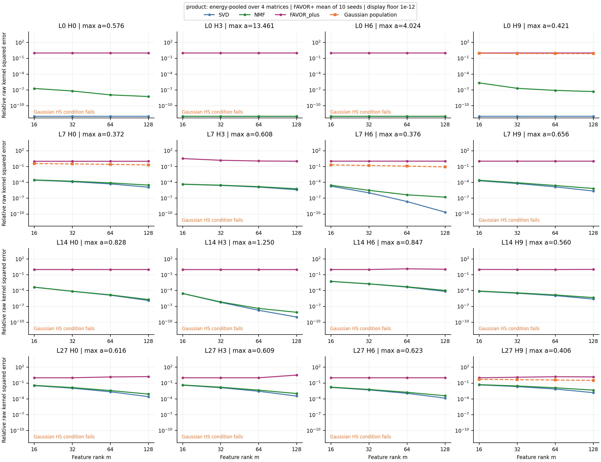
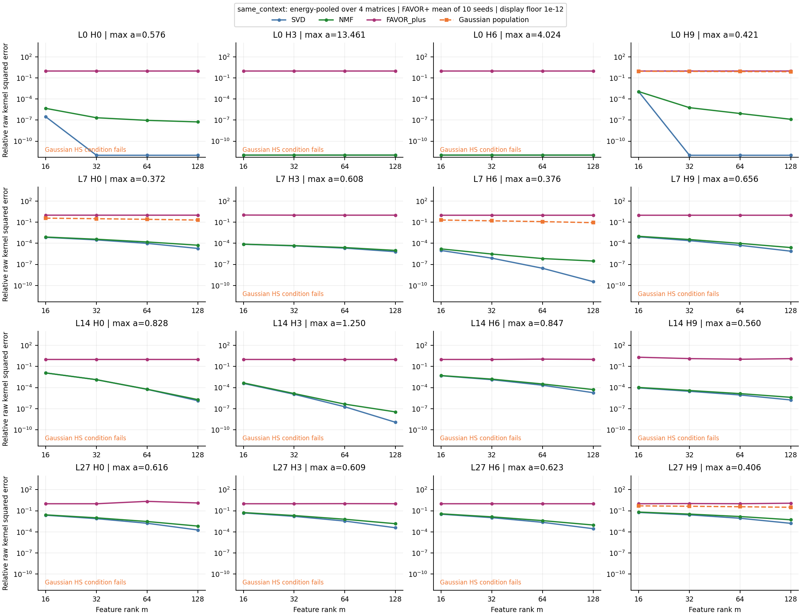
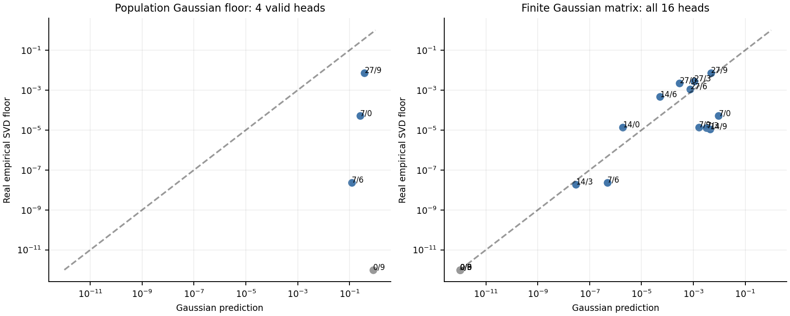

判定：**原封不动的“真实 covariance→Gaussian 总体谱→真实 head 理论极限”主线暂不 Go；“真实经验谱→正特征近似”的方法探索有条件 Go。** 本次没有训练或微调 LLM。

这不是用户列出的“Gaussian 不准且 NMF≈FAVOR，所以全部停止”的组合。本次结果是：Gaussian 总体谱对多数 head 不适用，但有限矩阵的 NMF 明显优于 FAVOR+，因此两个研究环节需要分开判断。

**先校正理论陈述**

在 κ∈L²(PQ×PK)、允许独立且有符号的两侧平方可积 feature maps 时，Schmidt 分解给出

$$\inf_{\operatorname{rank}\hat\kappa\le m}\|\kappa-\hat\kappa\|_{L^2}^2=\sum_{r>m}\sigma_r^2.$$

它是正特征方案的下界，但不能称作所有正特征方案都可达到的最小误差。共享正指数特征+非负quadrature权重又比自由的两个非负因子更受限制。

对独立零均值 Gaussian，定义 A=ΣQ^(1/2)ΣK^(1/2)/√d，奇异值为 ai，则必须有 max ai<1/2。此时

$$\mathbb E\kappa^2=\prod_i(1-4a_i^2)^{-1/2},\quad
\rho_i=\frac{2a_i}{1+\sqrt{1-4a_i^2}},\quad
\sigma_\alpha=\prod_i\sqrt{1+\rho_i^2}\,\rho_i^{\alpha_i}.$$

该谱公式正确，可以由 [Mehler 恒等式](https://dlmf.nist.gov/18.18.E28)推出；本次使用 Gauss–Hermite 求积独立验证了一维谱、非零线性项及多维模式排序。当 max ai≥1/2 时，Gaussian surrogate 的二阶矩发散，不能再报告有限总体 L2谱尾，更不能把 ai 截到0.499。真实 LLM 的有限权重、RMSNorm 和 RoPE 给出不同的有界支持情形；Gaussian 失效不表示真实 kernel 发散。

真实 Q/K 均值不为零。令 q=μQ+BQx、k=μK+BKy，b=BQᵀμK/√d、c=BKᵀμQ/√d、t=μQᵀμK/√d，l=[b;c]，M=[[I,−2A],[−2Aᵀ,I]]。在 HS 条件满足时，将 Gaussian 密度平方根吸收进核并平移 Lebesgue 坐标，得到

$$\sigma_\alpha^{\rm nonzero\ mean}
=\exp(t+l^\top M^{-1}l)\,\sigma_\alpha^{\rm zero\ mean}.$$

因此均值只改变总体谱的公共幅度，**相对谱尾**仍由 covariance 决定；但绝对误差需包含均值。有限样本矩阵却会强烈受到均值及其诱发的权重集中影响，不能把“总体相对谱与均值无关”搬到有限样本矩阵上。

**实验协议**

冻结 Qwen2.5-1.5B，复用真实投影、RoPE 后的 BF16 Q/K；第0、7、14、27层各选query head 0、3、6、9，共16个。选取覆盖不同层且不按Gaussian有效性筛选。正确处理 GQA；d=128；m=16/32/64/128。

校准用64篇训练文章，每个边缘分布32,768个向量，并检查16/32/64篇时的covariance估计。评估用20篇来源于官方WikiText-2 test split的固定1024-token文章前缀，是所选子集，不是完整benchmark。主实验每次从测试边缘池中独立抽取512个Q和512个K，构造P_Q×P_K的经验乘积矩阵，重复4次。矩阵包含跨文档配对，是分布核诊断，不是实际attention运行。另取4篇同上下文的合法512×512矩形块，作为部署相关对照；其分布不同，未混入主实验。

SVD使用Float64，每个矩阵的离散概率权重为1/512，绝对MSE是平方误差和/512²。NMF求解同一原始kernel的Frobenius近似，初值包含NNDSVD、随机正因子以及较低rank解扩展；每种初值1600次乘法更新，取每个head的最低可行误差。它是测试矩阵上的transductive因子化，不是训练LLM，也不是已可泛化的feature network。实际NMF误差是正因子最优误差的可行上界，部分试验仍有优化空间，不能称为精确非负rank下界。

FAVOR+使用 [Performer 论文](https://arxiv.org/abs/2009.14794)的正高斯正交随机特征，Haar正交方向配独立χ_d半径；每个head10个种子，所有m使用同一投影矩阵的前m行。ψω(q)=exp(d^(−1/4)ωᵀq−||q||²/(2√d))。用logsumexp计算原始feature内积，没有epsilon或未恢复的逐行缩放。另报告正确恢复所有线性项和常数项的训练均值中心化版本，作为辅助基线。数学表达式与[官方实现](https://github.com/google-research/google-research/blob/master/performer/fast_attention/tensorflow/fast_attention.py)对应；官方用于归一化attention的数值平移在此必须恢复，才能评价原始K。

全部曲线评估未归一化 exp(qᵀk/√d)。为了跨head比较，正文使用相对平方误差；每个head先按真实kernel平方能量合并4次矩阵抽样，FAVOR再对10个种子平均。绝对MSE的对数同时保存，以免指数幅度溢出。图中≤1e−12的值放在显示下限，极小数不作为精确数值证书。

**四条曲线的结果**

Gaussian公式只有4/16个head满足适用条件；16/32/64篇校准的逐head检查保存在gaussian.json。对有效head以外的12个不填造数值。

下表是主实验16个head的中位数；FAVOR列先在每个head中平均10个种子。提升率定义为(E_FAVOR−E_NMF)/E_FAVOR。

| m | SVD误差 | NMF可行误差 | FAVOR+误差 | NMF相对提升中位数 | 提升≥25%的head |
|---|---|---|---|---|---|
| 16 | 0.0001401 | 0.0001671 | 1 | 99.983% | 16/16 |
| 32 | 4.671e-05 | 5.721e-05 | 1 | 99.994% | 16/16 |
| 64 | 1.328e-05 | 1.553e-05 | 1 | 99.998% | 16/16 |
| 128 | 2.434e-06 | 5.453e-06 | 1 | 99.999% | 16/16 |

这是明显的有限矩阵可改进空间；特别是存在低误差非负因子，说明在这个宽松的矩阵类中，positivity本身不必造成接近FAVOR的误差。但NMF并不约束因子来自同一指数feature族或共享quadrature节点，也不保证新Q/K上的误差。



m=64的逐head结果：

| head | max ai | Gaussian总体相对误差 | 真实SVD | 真实NMF | FAVOR+ |
|---|---|---|---|---|---|
| [0, 0] | 0.5757 | 不适用 | ≤1e−12 | 1.17e-08 | 1 |
| [0, 3] | 13.4612 | 不适用 | ≤1e−12 | ≤1e−12 | 1 |
| [0, 6] | 4.0236 | 不适用 | ≤1e−12 | ≤1e−12 | 1 |
| [0, 9] | 0.4210 | 0.8009 | ≤1e−12 | 8.198e-08 | 1 |
| [7, 0] | 0.3724 | 0.2564 | 5.179e-05 | 7.966e-05 | 0.9962 |
| [7, 3] | 0.6079 | 不适用 | 1.283e-05 | 1.549e-05 | 1.13 |
| [7, 6] | 0.3757 | 0.1204 | 2.358e-08 | 4.382e-07 | 1 |
| [7, 9] | 0.6560 | 不适用 | 1.405e-05 | 2.562e-05 | 1 |
| [14, 0] | 0.8281 | 不适用 | 1.374e-05 | 1.556e-05 | 1.001 |
| [14, 3] | 1.2499 | 不适用 | 1.892e-08 | 4.248e-08 | 1 |
| [14, 6] | 0.8466 | 不适用 | 0.0004662 | 0.0005385 | 1.371 |
| [14, 9] | 0.5602 | 不适用 | 1.132e-05 | 1.535e-05 | 0.999 |
| [27, 0] | 0.6160 | 不适用 | 0.002231 | 0.003806 | 1.448 |
| [27, 3] | 0.6090 | 不适用 | 0.002782 | 0.004533 | 1.005 |
| [27, 6] | 0.6229 | 不适用 | 0.00113 | 0.00178 | 1 |
| [27, 9] | 0.4056 | 0.3752 | 0.007348 | 0.01276 | 1.586 |

第0层的经验矩阵几乎退化到很低rank，不能让这些容易的head掩盖其余head的情况。同上下文对照单独见下图及curves.csv；原始kernel的极端权重集中使跨文档乘积矩阵与同上下文矩阵的误差、以及不同重复之间都可能明显不同。



**用户提出的Spearman门槛是否通过**

比较总体谱时只允许使用4个有效head。绝对风险同时给出用户零均值公式及包含实际均值幅度的Gaussian修正；后者已经不再是只用covariance预测绝对误差。相对风险使用同一个Gaussian谱形状。另有一个完全不同的量：从拟合Gaussian抽取同样大小的有限矩阵，再计算其SVD，称为有限Gaussian预测。

| m | 有效head数 | 总体相对谱ρ | 零均值总体绝对ρ | 含均值总体绝对ρ | 有限Gaussian全16ρ | 有限Gaussian去第0层ρ |
|---|---|---|---|---|---|---|
| 16 | 4 | -0.200 | 0.400 | 1.000 | 0.704 | 0.308 |
| 32 | 4 | -0.200 | 0.400 | 1.000 | 0.722 | 0.350 |
| 64 | 4 | -0.200 | 0.400 | 1.000 | 0.740 | 0.392 |
| 128 | 4 | -0.200 | 0.400 | 1.000 | 0.785 | 0.497 |

原始总体Gaussian相对谱的相关性没有达到0.6，有效head数量也不足以支持跨8–16个head的预测主张。加入实际均值幅度后，4个有效head的绝对误差排序达到1.0，但这不再是原始零均值covariance-only公式，也没有预测准确误差量级。例如m=64时，(7,0)的绝对预测约高77倍，(7,6)约高17亿倍，(27,9)约高479倍。第0层的SVD尾值已经低于数值分辨率，其绝对尾误差与相关性还要额外谨慎。因此绝对幅度造成的高排序不能替代定量校准检验。4个head的置换检验和相关性细节保存在summary.json。

有限Gaussian全16个head的相关性达到约0.70—0.79，但这不是用户给出的闭式总体谱预测。去掉第0层四个极低误差head后，相关性仅约0.31—0.50；m=64时其余12个head的典型量级偏差约8.35倍，只有3个落在真实SVD误差的2倍范围内。不能凭全16个相关性超过0.6，就宣布“Gaussian理论下界预测成功”。



**为什么总体公式与有限SVD不能直接等同**

本次补做了真正Gaussian样本的控制实验。下面均为512×512矩阵、m=64，有限矩阵列是3次随机抽样的相对误差算术平均，故与主表的能量合并口径有所不同：

| head | Gaussian总体谱尾 | 零均值Gaussian有限矩阵 | 含均值Gaussian有限矩阵 |
|---|---|---|---|
| [0, 9] | 0.8009 | 0.1857 | ≤1e−12 |
| [7, 0] | 0.2564 | 0.1191 | 0.009318 |
| [7, 6] | 0.1204 | 0.05574 | 9.997e-06 |
| [27, 9] | 0.3752 | 0.1331 | 0.006751 |

即使Gaussian假设完全成立，小矩阵的oracle也明显低估总体最优风险。有限矩阵只看到有限支持，并且可以针对该矩阵重新选择最优因子；总体谱要求一个函数对整个分布成立。权重集中及稀有事件进一步放大差异：例如(0,9)的含均值Gaussian总体log E[K²]约1381，而有限样本中观测到的尺度远低于它。这不是Mehler公式错误，而是总体与有限样本没有对齐。

控制还比较了n=256/512/1024以及真实矩阵n=1024，全部数值在results/controls.json。有限谱随n变化，不支持将512点oracle视为已经收敛的总体谱估计。对于HS无效的Gaussian，任何有限抽样矩阵依然存在，但它的有限误差绝不能冒充总体L2界。

**Go／No-Go的具体决定**

原主线暂不Go的原因有三项：大多数真实head的covariance对应一个HS失效的无界Gaussian surrogate；仅余4个有效head的总体相对谱没有预测真实矩阵的排序和量级；总体谱与有限SVD的直接对照还混入严重有限样本偏差。当前不能基于这些ρ_i给大多数head设计有理论保证的quadrature。

正特征方法探索可以有条件Go，因为已经找到远优于FAVOR+的非负矩阵因子。不过下一阶段真正需要跨过的门槛是：用训练数据确定、并在独立文档上泛化的正feature map或共享正quadrature，也能缩小这个gap。NMF目前只证明宽松矩阵类里有空间；相同ψω和非负wr的quadrature是更小的函数类，不能直接继承NMF误差。

推荐将主线改成“有界/混合真实分布→经样本规模检验的经验或总体谱→正特征可行性→跨文档泛化”，将Gaussian闭式谱保留为适用域明确的对照。对于仍在探索的Gaussian有限矩阵预测，应独立报告它是有限尺度代理模型，而不是理论下界。不要通过降低temperature、截断ai或删掉极端Q/K来隐式改变原始kernel后宣称原主线成立。

NMF≈FAVOR也不应单独作为数学意义的No-Go证据，因为数值NMF可能没优化好；本次实际没有出现这种组合。反过来，优于未经LLM适配的FAVOR+也不足以证明优于学习型正特征方法，更不足以支持顶会结论。

**验证、文件与复现**

主实验128个矩阵，4个rank；FAVOR+及均值修正版各10个种子。SVD下界、NMF非负更新的目标单调性、FAVOR原始kernel的log域计算与直接计算、均值修正恒等式，以及已知精确非负因子的固定点均检查通过。NMF冷启动不保证达到全局最优；method_checks.json特意将这一点与数值正确性分开。

`curves.csv`保存每个head/rank的四曲线及辅助baseline；`summary.json`保存门槛判定、相关性、绝对误差对数及审计。`results/`保存每个抽样矩阵的索引、SVD谱、所有NMF优化轨迹、所有FAVOR种子结果、Gaussian参数及控制实验。模型revision为`8faed761d45a263340a0528343f099c05c9a4323`，原始缓存manifest记录文档来源和哈希。

```bash
/root/autodl-tmp/conda-envs/nonlinear-qk/bin/python kan_attention_theory/gaussian_go_nogo/run.py --nmf-steps 1600 --favor-seeds 10
/root/autodl-tmp/conda-envs/nonlinear-qk/bin/python kan_attention_theory/gaussian_go_nogo/controls.py
/root/autodl-tmp/conda-envs/nonlinear-qk/bin/python kan_attention_theory/gaussian_go_nogo/finite_gaussian.py
/root/autodl-tmp/conda-envs/nonlinear-qk/bin/python kan_attention_theory/gaussian_go_nogo/check_methods.py
/root/miniconda3/bin/python kan_attention_theory/gaussian_go_nogo/summarize.py
```

运行位置为/root/autodl-tmp。主脚本可跳过已有矩阵结果；从头运行可先指定新的--out目录，并让控制及汇总脚本读取对应目录。根目录早期smoke输出仅用于流程验证，正式结果统一在results/。
