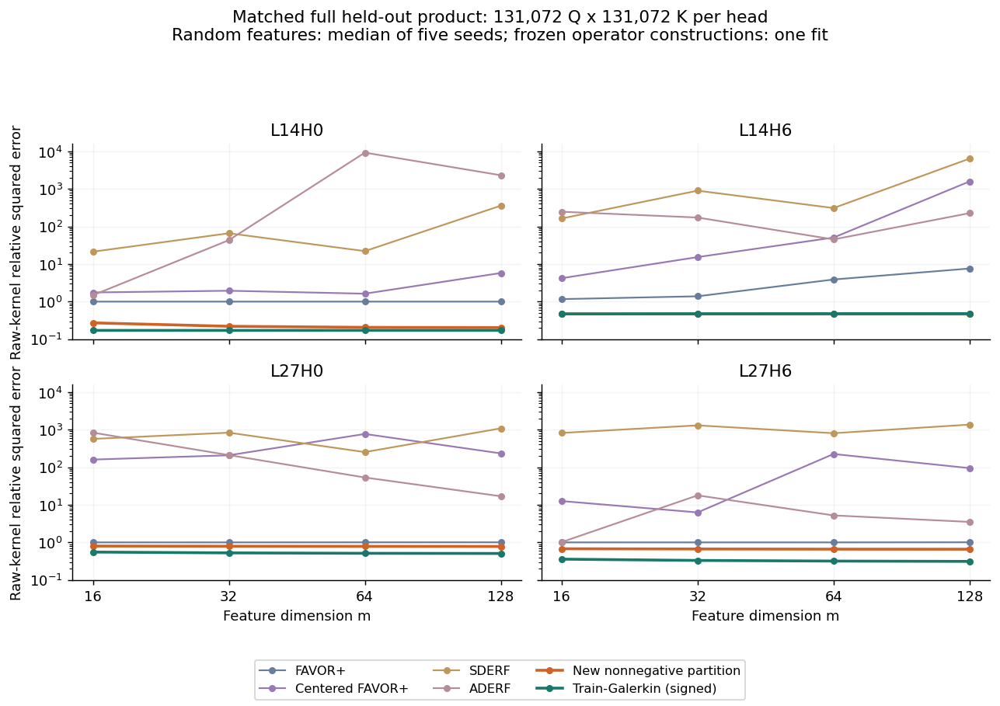
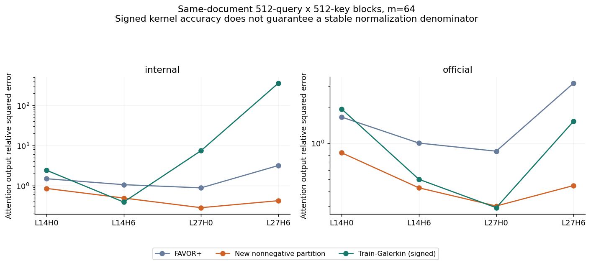
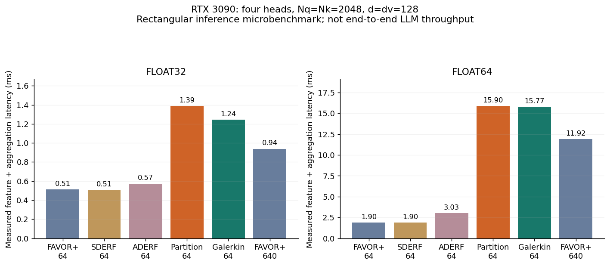

后续更新：已完成双方融合算子、完整模型 4/336-head 替换困惑度、缓存推理和更紧的完整经验谱界，见[部署与谱界验证报告](../deployment_validation/REPORT.zh.md)。新正 kernel 保留了质量优势，但本轮没有推理收益，且在完整经验算子上明显不接近无约束 rank-64 最优误差。

本轮已完成用户要求的同协议kernel对比、可调用Galerkin特征构造与计算量评估。**在这四个真实Qwen head及指定留出协议上，m=64新分区正kernel的raw-kernel误差优于本轮FAVOR+、均值校正FAVOR+、SDERF、ADERF的全部五个测试种子；但它明显更贵。Galerkin的乘积分布kernel误差更低，却因负kernel项及分母抵消，在真实attention块上出现输出不稳定。**

此前“新kernel与FAVOR尚无同协议比较”的状态已由本轮补齐。这个结果不等于新方法接近总体rank-m下界，也不等于全模型困惑度或速度已获改善。

**Galerkin与已有linear attention研究的关系。** Galerkin attention并非没有相关文献。Shuhao Cao的NeurIPS 2021论文《Choose a Transformer: Fourier or Galerkin》提出了与Petrov–Galerkin投影联系的线性attention，典型形式为Q( K̃ᵀṼ )/n，实验针对PDE算子学习。它并不是对冻结LLM的exp(qᵀk/√d)进行训练分布谱截断。[原论文](https://proceedings.neurips.cc/paper/2021/file/d0921d442ee91b896ad95059d13df618-Paper.pdf)

这里的“训练Galerkin”是本项目由真实Q/K训练积分算子构造的kernel，应作为我们自己的候选构造或对照，不能冒充上述论文的复现，也不能替代FAVOR类基线。

**本轮比较对象与协议。** 主基线为FAVOR+的正交高斯正特征，以及DERF论文的SDERF和ADERF解析特征，另加入利用训练均值精确分解原始点积的均值校正FAVOR+。FAVOR+使用高斯边缘的正交节点：Haar正交方向乘独立χ₁₂₈半径，不采用固定半径的regularized softmax替代原始kernel。SDERF和ADERF是论文特征公式的实现，不是完整FAVOR#语言模型系统的复现。[Performer原论文](https://arxiv.org/abs/2009.14794)、[DERF原论文](https://proceedings.neurips.cc/paper_files/paper/2023/file/02dec8877fb7c6aa9a79f81661baca7c-Paper-Conference.pdf)

固定Qwen/Qwen2.5-1.5B，revision为8faed761d45a263340a0528343f099c05c9a4323，使用实际投影和RoPE后的Q/K；d=128，head为L14H0、L14H6、L27H0、L27H6。随机特征的均值、二阶矩与解析参数来自与新kernel相同的4096篇训练文档，每篇每侧32个位置，共131072个训练向量/边缘。新kernel原先将这些文档分为两组：一组构造谱分区，另一组估计cell均值。测试时所有方法参数冻结。

主实验m=16/32/64/128，RF各五个种子1009、1046、1083、1120、1157；不同m使用同一个128节点集合的嵌套前缀并修正1/√m。所有方法使用完全相同的留出向量、原始kernel与经验概率权重。内部留出为256篇文档，每侧131072个向量的完整乘积，四个head共68719476736个pair；官方子集为固定20篇WikiText2 test文章前缀，每侧10240个向量的完整乘积。内部数据来自WikiText103源train按文档划分，官方子集不是完整官方benchmark。统计独立单位不能按pair数量计算。

目标和主要指标为

$$\kappa(q,k)=e^{q^\top k/\sqrt{128}},\qquad
\mathrm{NMSE}=\frac{\sum_{i,j}(\hat\kappa(q_i,k_j)-\kappa(q_i,k_j))^2}{\sum_{i,j}\kappa(q_i,k_j)^2}.$$

没有对标签做行归一化、裁剪或温度调整。分块Float64计算完整产品风险。为避免存储整张矩阵，利用

$$\|FG^\top\|_F^2=\operatorname{tr}[(F^\top F)(G^\top G)],\qquad
\langle K,FG^\top\rangle=\sum_{i,r}F_{ir}(KG)_{ir}.$$

不同方法复用同一批真kernel值。数值用的head/特征常数都精确恢复；不是测试时拟合幅度。新分区和Galerkin风险复用上轮完整产品算子矩，并独立核验优化后的可调用特征与原构造一致。

**同维度raw-kernel结果。** 以下RF列为五个种子的中位数，新分区及Galerkin为固定的一次训练构造。预测恒零的NMSE为1。

内部完整经验乘积，m=64：

| head | FAVOR+ | 均值校正FAVOR+ | SDERF | ADERF | 新分区kernel | 训练Galerkin（有符号） |
|---|---|---|---|---|---|---|
| L14H0 | 1.0000 | 1.6251 | 22 | 9.21e+03 | 0.2065 | 0.1717 |
| L14H6 | 3.8765 | 50.6 | 309 | 45.2 | 0.4677 | 0.4776 |
| L27H0 | 1.0045 | 768 | 253 | 53.3 | 0.7842 | 0.5123 |
| L27H6 | 1.0000 | 225 | 804 | 5.2238 | 0.6608 | 0.3181 |

官方20篇文档完整经验乘积，m=64：

| head | FAVOR+ | 均值校正FAVOR+ | SDERF | ADERF | 新分区kernel | 训练Galerkin（有符号） |
|---|---|---|---|---|---|---|
| L14H0 | 1.0000 | 1.1222 | 2.0182 | 1.27e+03 | 0.2541 | 0.2197 |
| L14H6 | 1.0014 | 1.7381 | 2.2886 | 1.6389 | 0.9456 | 0.9427 |
| L27H0 | 1.0005 | 458 | 239 | 1.8579 | 0.6879 | 0.3838 |
| L27H6 | 1.0000 | 25.8 | 330 | 1.1672 | 0.5987 | 0.2371 |

两个数据集上，新分区kernel都低于每一种RF基线的每个测试种子，m=64共160个逐种子比较均成立。这个陈述只覆盖这次已测试的种子、head和数据，不能推成随机特征方法的理论不可能性。Galerkin在内部3/4个head、官方4/4个head的raw乘积误差低于新分区kernel。

RF误差分布高度偏斜，因此不能只展示中位数。下面同时给出内部m=64的均值及范围：

| head | 方法 | 五种子均值 | 五种子最小—最大 |
|---|---|---|---|
| L14H0 | FAVOR+ | 1.0000 | [0.9999, 1.0003] |
| L14H0 | 均值校正FAVOR+ | 142 | [1.0473, 685] |
| L14H0 | SDERF | 2.06e+05 | [1.1307, 1.03e+06] |
| L14H0 | ADERF | 2.86e+05 | [8.4154, 1.39e+06] |
| L14H6 | FAVOR+ | 296 | [1.0929, 1.37e+03] |
| L14H6 | 均值校正FAVOR+ | 2.98e+03 | [13.7, 1.16e+04] |
| L14H6 | SDERF | 3.57e+04 | [10.1, 1.76e+05] |
| L14H6 | ADERF | 1.1e+04 | [17.4, 5.47e+04] |
| L27H0 | FAVOR+ | 1.0144 | [1.0000, 1.0449] |
| L27H0 | 均值校正FAVOR+ | 2.24e+03 | [53.8, 9.15e+03] |
| L27H0 | SDERF | 1.27e+03 | [37.5, 4.16e+03] |
| L27H0 | ADERF | 69.8 | [2.0985, 145] |
| L27H6 | FAVOR+ | 1.0137 | [1.0000, 1.0646] |
| L27H6 | 均值校正FAVOR+ | 2.5e+03 | [20.9, 6.37e+03] |
| L27H6 | SDERF | 2.71e+05 | [14.9, 1.35e+06] |
| L27H6 | ADERF | 32.4 | [1.0388, 101] |

FAVOR+不少head的典型误差接近零预测；另一些RF配置被过高预测主导，少数种子的误差非常大。SDERF/ADERF的解析方差目标并不保证这些冻结LLM Q/K上的有限节点L²风险优于FAVOR+。这组实验不能代表在其他输入缩放、任务训练、更多节点或其他调参协议下的论文系统结果。



**更高计算预算的随机特征对照。** 为避免只比较同m却忽略计算量，将原先五个128-node正交块预先全部合并，得到m=640的RF。不是选最优种子，也不是五个独立640维重复实验：它是一个固定的五块并集。完整kernel交叉项可由五个128维kernel交叉项取均值精确获得，预测平方能量另算全部跨块Gram项；没有遗漏跨节点块交互。

FAVOR+ m=640的结果为：

| 数据 | head | FAVOR+ m=640 | 新分区m=64 | Galerkin m=64 |
|---|---|---|---|---|
| internal | L14H0 | 1.0000 | 0.2065 | 0.1717 |
| internal | L14H6 | 16 | 0.4677 | 0.4776 |
| internal | L27H0 | 1.0012 | 0.7842 | 0.5123 |
| internal | L27H6 | 1.0030 | 0.6608 | 0.3181 |
| official | L14H0 | 1.0000 | 0.2541 | 0.2197 |
| official | L14H6 | 6.7828 | 0.9456 | 0.9427 |
| official | L27H0 | 1.0005 | 0.6879 | 0.3838 |
| official | L27H6 | 1.0007 | 0.5987 | 0.2371 |

另外三类m=640结果均保存在CSV。五块并集的平方误差均不超过对应五个128维kernel误差的均值，32组凸性检查通过。由于嵌套节点从64增加到128可能引入新的假峰值，m=640并不保证比m=64的某个种子或中位数更好。

m=640 FAVOR+的主导总FLOPs约是m=64 FAVOR+的10倍；新分区m=64约12.75倍，Galerkin m=64为12.5倍。因此这个参考更接近算子构造的预算，但仍不是严格等FLOPs或等时延。新分区与Galerkin在两个产品数据集的四个head上也都低于这个固定m=640 FAVOR+实现；不能据一个并集配置估计m=640的随机种子置信区间。

**Galerkin已实现为可调用kernel。** 设训练锚点数量a=1024，定义

$$z_Q(q)=[\kappa(q,\bar k_1),\ldots,\kappa(q,\bar k_a)],\quad
z_K(k)=[\kappa(\bar q_1,k),\ldots,\kappa(\bar q_a,k)].$$

先用训练字典的Gram矩阵正交化得到A_Q(q)、A_K(k)，再计算训练分布压缩

$$C_{\rm train}=\mathbb E_{\rm train}[\kappa(Q,K)A_Q(Q)^\top A_K(K)]
=U S V^\top.$$

这里A_Q、A_K写作行向量。取前m个奇异方向：

$$\phi_Q^G(q)=A_Q(q)U_mS_m^{1/2},\qquad
\phi_K^G(k)=A_K(k)V_mS_m^{1/2}.$$

将所有固定线性变换离线合并，可以直接实现为

$$\boxed{\phi_Q^G(q)=z_Q(q)C_Q,\quad
\phi_K^G(k)=z_K(k)C_K,\quad
\hat\kappa_G(q,k)=\phi_Q^G(q)\phi_K^G(k)^\top.}$$

C_Q、C_K均为a×m固定矩阵，运行时不用再显式生成256维中间谱坐标。代码中的head数值缩放是上述原始kernel表达的等价实现。优化后特征与原始多步变换的相对L²偏差低于2.8×10⁻¹⁵。

新分区kernel仍为

$$\hat\kappa_P(q,k)=e_{c(q)}^\top B e_{d(k)},\quad
\phi_Q^P(q)=e_{c(q)},\quad\phi_K^P(k)=B e_{d(k)}.$$

它的分区坐标来自锚点kernel的64维投影。此次将原先逐节点Python遍历改为路径判定矩阵计算，避免把低效遍历开销当作方法本身的成本；FP64划分与原实现逐项一致。该路由实现额外使用O(Nm²)的小矩阵运算，理论上的直接树遍历则可用O(N·depth)比较。

**更低kernel误差没有保证Galerkin的attention输出更好。** 在全部256篇内部文档和20篇官方子集上，额外计算实际同文档矩形块：后512个Q对前512个K，V也取真实缓存。该块内所有key在query之前；它不包含其他可见key，因此不是完整因果attention或完整LLM替换。kernel误差仍对raw exp函数计算，输出评估才使用标准线性attention分母。没有对负kernel项裁剪，也没有修补分母。

内部m=64输出相对平方误差及Galerkin符号诊断：

| head | FAVOR+输出误差中位数 | 新分区输出误差 | Galerkin输出误差 | Galerkin负kernel条目 | Galerkin非正分母行 |
|---|---|---|---|---|---|
| L14H0 | 1.4935 | 0.8558 | 2.4340 | 19.36% | 0.0328% |
| L14H6 | 1.0604 | 0.4926 | 0.3909 | 26.47% | 0.0107% |
| L27H0 | 0.8835 | 0.2829 | 7.4612 | 20.24% | 0.0359% |
| L27H6 | 3.1831 | 0.4227 | 360 | 19.06% | 0.0877% |

Galerkin约19%—27%的kernel条目为负；比例按条目数计，不代表相同的负质量比例。少量行的分母为负或发生严重抵消，会放大输出误差。L27H6的输出NMSE达到约360，明显差于新分区kernel的0.423。新分区kernel在本轮所有同文档块上都没有负kernel项或非正分母。

官方子集对应的Galerkin输出误差为1.935、0.502、0.291、1.526；新分区为0.835、0.426、0.301、0.445。Galerkin只有其中一个head略优于新分区，因此不能因为产品分布kernel误差更低，就把它当作稳定的正kernel替代。它可保留为有符号候选或谱逼近对照；逐元素裁剪kernel一般不能保持当前m维可分离表达，直接softplus两侧特征也会改变已证明/已测试的kernel。

新分区在同文档块的raw-kernel误差也明显高于产品分布：内部四个head为0.7575、0.9941、0.9512、0.9414。即便它比本轮RF基线更好，也不能说原始kernel已经拟合得很准确。P_Q×P_K理论与真实同文档联合测度之间的差异需要继续保留。



**计算量需要包含特征生成。** 设每侧N个token，d_v为value维度，e=64为分区谱坐标维度，a=1024为锚点数。所有方法在特征已给定后，矩形线性attention的主导计算均为4Nm d_v FLOPs，推理流式状态为m(d_v+1)个标量/head。差异主要来自生成特征：

| 方法 | 两侧特征生成的主导FLOPs | 主要固定系数/head |
|---|---|---|
| FAVOR+ / 均值校正 / 折叠后的SDERF | 4Ndm | dm，另加小偏置 |
| ADERF | 4Nd(d+m) | 2dm+2d²，另加小偏置 |
| 新分区 | 4Na(d+e)+4Nm(m−1) | 2a(d+e)+m²，另加路由表 |
| 折叠后的Galerkin | 4Na(d+m) | 2a(d+m) |

这些是矩阵乘加主导项，按一次乘加2 FLOPs计算，不包含exp、比较、小量elementwise或归一化。SDERF的正交旋转可折叠进投影，且范数不变，因此其推理主导成本与FAVOR+相同。ADERF额外保留两侧一般二次型的范数计算。新分区和Galerkin每对Q/K需要2a次exp，FAVOR+为2m次；m=64时前者的exp数量也是后者的16倍。

**实测耗时。** RTX 3090，四个head，N_Q=N_K=2048，d=d_v=128，batch=1；无反向传播、关闭TF32，4次预热及20次CUDA-event计时取中位数。所有计时期间没有其他GPU实验。下表包括特征生成和矩形线性汇总，GFLOPs按上述主导公式计算。

| 方法 | m | 主导GFLOPs | FP32时间/ms | FP64时间/ms |
|---|---|---|---|---|
| FAVOR+ | 64 | 0.537 | 0.512 | 1.895 |
| 均值校正FAVOR+ | 64 | 0.537 | 0.515 | 1.894 |
| SDERF | 64 | 0.537 | 0.506 | 1.895 |
| ADERF | 64 | 1.074 | 0.572 | 3.029 |
| 新分区kernel | 64 | 6.843 | 1.389 | 15.905 |
| 训练Galerkin（有符号） | 64 | 6.711 | 1.244 | 15.771 |
| FAVOR+ | 640 | 5.369 | 0.938 | 11.923 |

新分区m=64在FP32下约为FAVOR+ m=64的2.72倍时间，Galerkin为2.43倍；FP64下两者约8.39和8.32倍。FLOPs比例与时间比例不同，是因为矩阵尺寸、GPU利用率、内存流量和算子启动开销不同。不能只按m宣称计算量相等，也不能将这些矩形块微基准称为完整LLM吞吐或完整因果prefill速度。

FP32下每head实际模型tensor存储约为：FAVOR+ m=64 32.5 KiB，新分区1585.5 KiB，Galerkin1536.0 KiB。N=2048时测得的增量峰值分别约12.2、66.0、66.0 MiB（四个head合计，含临时特征及锚点矩阵，未含已有模型/输入）。FAVOR+ m=640模型存储为325 KiB/head，增量峰值约81.3 MiB；其流式attention状态比m=64大10倍。固定参数与训练参数不能混为一谈，本轮是同特征维度及额外预算参考，不是等参数KAN/MLP架构比较。

FP64用于主准确度评估，FP32另在固定四篇留出文档的2048×2048产品上检查数值误差：新分区没有改变任何分区归属；新分区/Galerkin的NMSE与FP64最大绝对差均小于5.6×10⁻⁸。该检查支持本次FP32微基准的数值可用性，但不代替全量FP32或BF16模型评估。



**离线构造也有成本。** RF统计校准主要需要训练二阶矩和d×d矩阵分解。当前两个算子构造还需要1024×1024锚点kernel/SVD；本项目的精确moment-fit实现穷举65536²个训练pair/head，再累积条件均值或Galerkin核心。这个离线过程含二次训练配对成本，不能因为推理对N线性，就把整个构造流程也称为线性成本。实际部署时需要按不同模型/head及分布变化考虑重新构造的摊销。

**本轮判断。** 在已测试协议中，新分区正kernel确实获得了相对FAVOR类基线的拟合优势，也通过了固定参数的未见文档测试；这解决了此前缺少同协议比较的问题。代价是锚点特征计算、固定参数量和临时内存更大，仍未接近已知rank-m界。同文档raw kernel误差与产品测度结果差别很大，完整LLM困惑度与推理收益仍未评估。Galerkin可以作为具体kernel构造保留，但当前有符号版本不宜直接作为标准正线性attention的替换。

因此现阶段更准确的研究主张是“在冻结真实Q/K上，以更高特征计算成本换取比本轮RF基线更低的原始kernel风险”，而不是“已经实现更快、更准确且接近理论最优的线性attention”。还没有建立KAN或mulKAN的独占优势。

**检查和复现。** 736条kernel曲线、208条同文档诊断、168组微基准配置均已保存。704组rank下界检查、32组RF并集凸性检查、80组直接矩阵与矩公式风险检查通过；完整产品真kernel能量与上轮缓存最大相对差2.3×10⁻¹⁶，并集与五个kernel直接平均的预测偏差小于3.0×10⁻¹⁵。代码和数据索引保留在本目录。

```bash
/root/autodl-tmp/conda-envs/nonlinear-qk/bin/python compare.py
/root/autodl-tmp/conda-envs/nonlinear-qk/bin/python verify.py
/root/autodl-tmp/conda-envs/nonlinear-qk/bin/python pooled.py
/root/autodl-tmp/conda-envs/nonlinear-qk/bin/python attention_eval.py
/root/autodl-tmp/conda-envs/nonlinear-qk/bin/python benchmark.py
/root/autodl-tmp/conda-envs/nonlinear-qk/bin/python precision.py
/root/miniconda3/bin/python summarize.py
/root/miniconda3/bin/python write_report.py
```

准确度与微基准应顺序运行，避免其他GPU进程影响计时。已有结果文件会被部分脚本复用；改变协议应使用新输出目录。

[kernels.py](kernels.py)提供`PartitionFeatures(m)`、`GalerkinFeatures(m)`及`linear_attention`；输入shape为[4,n,128]，顺序L14H0/L14H6/L27H0/L27H6，`features(x,'q'/'k')`输出[4,n,m]。Galerkin输出带符号。主曲线见[kernel_curves.csv](kernel_curves.csv)，种子统计见[kernel_summary.csv](kernel_summary.csv)，同文档诊断见[attention_curves.csv](attention_curves.csv)，计算量及耗时见[benchmark.csv](benchmark.csv)。
