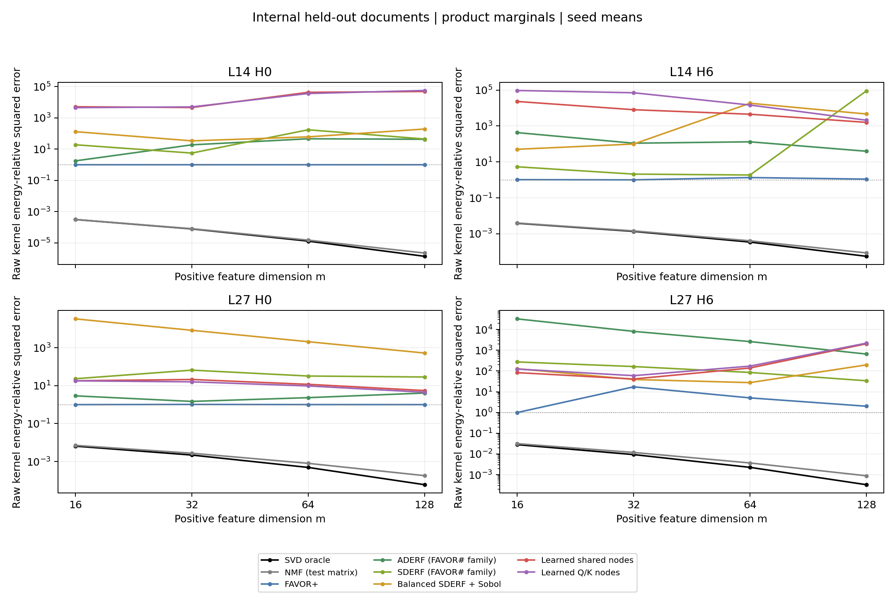
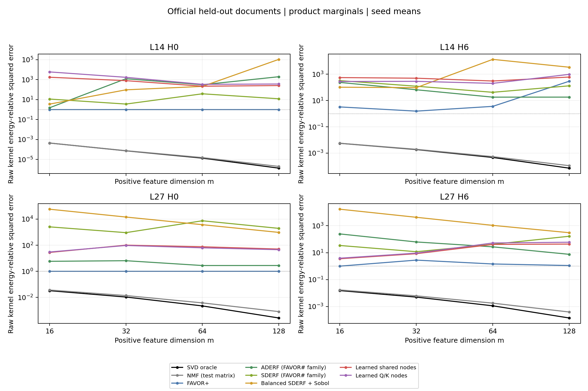
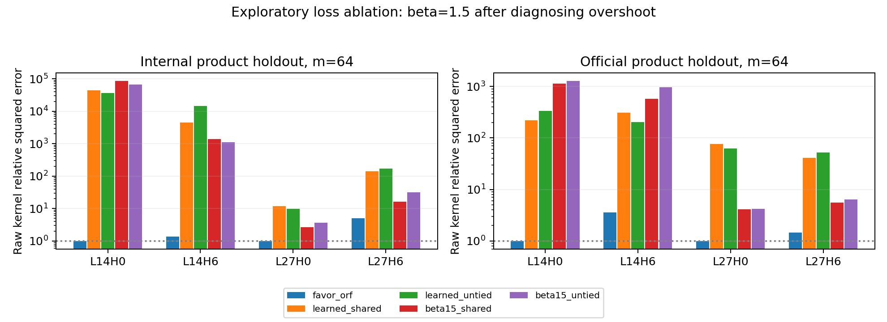
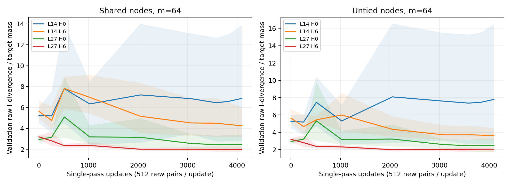

本轮判定：**当前“covariance 适配的正指数 quadrature＋单遍训练”实现 No-Go；没有兑现测试矩阵 NMF 展示出的精度空间。** 这个判定针对本轮函数构造、初始化、损失和优化设置的组合，不是对所有正特征、KAN 或 linear attention 的不可能性结论。

冻结真实 Qwen2.5-1.5B 后，共完成 **24 组主实验＋6 组损失消融**，每组包含4个独立的head模型。训练和评估目标始终是

$$\kappa(q,k)=\exp(q^\top k/\sqrt{128}),$$

没有把标签换成 softmax 概率。只有附加 attention 输出评估才通过分母归一化。所有实验在本地完成，没有使用子 agent。

**这一步验证什么**

上一轮得到的是：为每个测试矩阵直接求解 NMF，可以得到远低于 FAVOR+ 的误差。本轮要求 feature map 在见到测试文档之前就固定，检验这一空间是否能转化成可泛化的函数。

这个区分必须保留：测试矩阵上的 SVD、NMF 可以根据全部测试矩阵元素重新确定因子；本轮学习型特征和随机特征只能使用训练统计量。有限矩阵 NMF 是可行参照，不是已达到的总体正特征最优值。

**数据和协议**

- 模型：Qwen/Qwen2.5-1.5B，revision `8faed761d45a263340a0528343f099c05c9a4323`；使用真实投影和 RoPE 后缓存的 Q/K，正确处理 GQA。
- Heads：L14H0、L14H6、L27H0、L27H6。它们是此前大数据实验已经选定的4个head。本轮是上一轮16-head初筛后的增量验证，不是新的16-head全面评估。
- 大数据：4096篇训练、128篇验证、256篇内部测试文档，每篇1024 tokens。来源是 WikiText103 的源 train split，按文档划分，因此这里的“内部测试”不是官方benchmark test。
- 另用此前固定的20篇官方 WikiText2 test 文章前缀复核；这些文档与4096篇训练文档的token哈希无交集。这同样只是固定子集，不是完整benchmark。
- Q取位置512–1023，K取0–511。训练中对全部2,097,152个K向量做一次全局随机排列，与Q一一配对，目标是经验乘积分布。每个Q、K以及配对在每次运行中都恰好进入一次梯度更新。
- 每步512个新配对，共4096步；主实验 m=16/32/64/128、种子11/29/47、两种节点形式。固定 Adam 学习率0.003→0.0003、逐head梯度裁剪、最终checkpoint，没有依据测试分数选checkpoint。
- 训练前的均值、covariance和初始化幅度校准会读取训练数据；“单遍”指梯度训练配对不重复，不是声称整个算法只有一次数据读取。
- 两套测试文档分别取4次独立Q/K边缘池抽样，构造512×512乘积矩阵；另外各取4篇同上下文的合法矩形块。跨文档矩阵用于分布核诊断，同上下文块用于部署相关对照，二者分开汇总。

主实验做24组四head训练，随后依据过高预测诊断，增加6组 m=64 的 β=1.5 损失消融。后者是复用测试集的探索性结果，不能当作新独立测试集上的确认性结论。

**正特征的具体构造**

先令 $x=d^{-1/4}(q-\mu_Q)$、$y=d^{-1/4}(k-\mu_K)$。通过训练 covariance 的矩阵分解得到可逆变换

$$z_Q=B_Qx,\qquad z_K=B_Ky,\qquad B_Q^\top B_K=I.$$

因此 $z_Q^\top z_K=x^\top y$。小量ridge只用于选择稳定的可逆坐标，不截断 bilinear kernel，也没有改变温度。再定义

$$c_Q(q)=\frac{(q-\mu_Q)^\top\mu_K+\mu_Q^\top\mu_K/2}{\sqrt d},$$
$$c_K(k)=\frac{(k-\mu_K)^\top\mu_Q+\mu_Q^\top\mu_K/2}{\sqrt d}.$$

两侧特征为

$$f_r(q)=\sqrt{w_r}\exp\left(c_Q(q)-\frac{\|z_Q\|^2}{2}+\omega_{Q,r}^\top z_Q\right),$$
$$g_r(k)=\sqrt{w_r}\exp\left(c_K(k)-\frac{\|z_K\|^2}{2}+\omega_{K,r}^\top z_K\right),\quad w_r>0,$$

$$\hat\kappa(q,k)=\sum_{r=1}^{m} f_r(q)g_r(k).$$

shared版本约束 $\omega_{Q,r}=\omega_{K,r}$；untied版本允许两侧节点独立。这里的“共享节点”发生在变换后的空间，不表示原始q、k上完全相同的函数。两种形式都能放入标准linear attention公式。

初始化来自训练统计量适配的SDERF、经高斯逆CDF映射的scrambled Sobol节点，以及正的importance权重。再用固定的65,536个训练配对匹配整个head的平均kernel幅度。这个校准是一个head常数，不是逐行归一化。随后学习节点和log权重；学习完成后不再具有随机特征的无偏性保证。

m=64时，shared有8,256个可训练参数/head，untied有16,448个；可逆变换矩阵是训练统计量决定的固定参数。两种模型的参数量不同，此处比较的是解除节点共享的效果，不能作为等参数架构优势结论。本轮没有新增KAN/MLP架构对比；此前两层KAN、mulKAN与MLP的等参数实验仍应单独解读。

**基线与训练损失**

基线包括标准FAVOR+、FAVOR#论文中的SDERF和ADERF、covariance平衡后的FAVOR/SDERF，以及Sobol节点和训练幅度校准消融。每种固定特征基线10个随机种子、4种m。SDERF/ADERF是依据原论文公式实现的特征基线，不是对FAVOR#完整LLM系统的复现。[DERF / FAVOR#，NeurIPS 2023](https://proceedings.neurips.cc/paper_files/paper/2023/file/02dec8877fb7c6aa9a79f81661baca7c-Paper-Conference.pdf)

主实验最小化原始kernel的广义KL：

$$D_I(\kappa\|\hat\kappa)=\kappa\log\frac{\kappa}{\hat\kappa}-\kappa+\hat\kappa.$$

补充消融使用Bregman形式的β-divergence，本文采用β=1对应广义KL、β=2对应半平方误差的参数化：

$$D_\beta(\kappa\|\hat\kappa)=\frac{\kappa^\beta+(\beta-1)\hat\kappa^\beta-\beta\kappa\hat\kappa^{\beta-1}}{\beta(\beta-1)},\qquad\beta=1.5.$$

它对过高预测的增长量级是 $\hat\kappa^{1.5}$，比广义KL更强，又不是MSE。两种损失的数值缩放均是训练数据确定的head常数，原始目标在评估时完整恢复。[β-divergence的Bregman背景](https://www.mdpi.com/1099-4300/12/6/1532)

SVD与测试矩阵NMF继续使用原始kernel的平方误差，作为上一轮协议要求的谱诊断；这不代表神经特征训练改回了MSE。

**主要结果**

下面的误差是 $\sum(\hat K-K)^2/\sum K^2$。先按真实平方能量合并4次矩阵抽样，再对种子求均值；FAVOR为10种子，学习型为3种子。预测全零的误差等于1。

原官方测试子集，m=64：

| head | 测试矩阵NMF | FAVOR+ | shared，KL | untied，KL | shared，β=1.5 |
|---|---|---|---|---|---|
| L14H0 | 1.556e-05 | 1 | 220 | 338.5 | 1130 |
| L14H6 | 0.0005385 | 3.605 | 306.4 | 202.9 | 576.5 |
| L27H0 | 0.003806 | 1 | 75.82 | 63.1 | 4.15 |
| L27H6 | 0.00178 | 1.448 | 40.91 | 52.47 | 5.539 |

新增内部测试文档，m=64：

| head | 测试矩阵NMF | FAVOR+ | shared，KL | untied，KL | shared，β=1.5 |
|---|---|---|---|---|---|
| L14H0 | 1.486e-05 | 0.9999 | 4.339e+04 | 3.645e+04 | 8.722e+04 |
| L14H6 | 0.0004069 | 1.352 | 4536 | 1.472e+04 | 1392 |
| L27H0 | 0.0008073 | 1.006 | 11.74 | 9.655 | 2.625 |
| L27H6 | 0.00371 | 5.072 | 139.8 | 172.4 | 16.09 |

均值受到极端种子影响，但改看3个学习种子的中位数仍不通过。主实验shared在官方测试上的逐head中位数是272.28、247.40、69.44、6.50；内部测试为831.44、4092.49、7.18、36.09。这不是单个异常种子就能解释的失败。

本轮工程判据为：m=64时，在至少3/4个head上，比各固定RF基线的种子均值低25%以上，并且在至少3/4个head上达到测试矩阵NMF误差的10倍以内。学习型用种子中位数判定。**主实验在两套乘积分布、以及两套同上下文对照上均为0/4通过。** β=1.5消融也没有head达到NMF的10倍以内。

β=1.5在官方测试L27H0把shared的误差75.82降到4.15，在L27H6从40.91降到5.54，但L14H0和L14H6反而变差。因此不能把换损失本身视为完成了可泛化近似。

所有m的原始曲线、各RF单独结果、种子均值/中位数/极值和I-divergence均保存在curves.csv。m增大没有稳定解决学习型误差；不能根据某一个head或某一个种子选择性地宣称成功。







**失败原因：目前能确认与不能确认的部分**

第一，训练目标确实学到了某些有用的东西。以官方测试乘积分布的L27H0为例，FAVOR+的广义KL/真实质量为14.30，shared为1.85；对应同上下文块的attention输出误差均值，FAVOR+为1.159，shared为0.383。这里的输出比较是归一化后的附加指标，不是训练目标，且只覆盖4篇文档。它说明“KL/attention改善”和“接近原始kernel的L2谱尾”是不同的要求。

第二，本轮主要平方误差来自**过高预测**。在内部乘积测试上，合并4次抽样和3个种子的总SSE，shared四个head由过高预测贡献的比例依次为99.998%、99.987%、94.13%、99.51%；untied为99.998%、99.996%、93.01%、99.59%。在L14H0上，真实kernel最大0.1%的位置只占shared总误差约4.75%；大量错误来自模型在其它位置制造的大值。这与此前MLP主要低估真实极大值的情况不同。

第三，损失下降不能推出L2误差下降。令 $r=\log\hat\kappa-\log\kappa$，则

$$D_I=\kappa(e^r-1-r),\qquad(\hat\kappa-\kappa)^2=\kappa^2(e^r-1)^2.$$

过高预测时，前者对预测值近似线性增长，后者平方增长；这正是少量假峰值会主导平方误差的机制。β=1.5加强了这一侧的惩罚，但本轮仍不足以取得所需精度。

第四，不能把当前误差当成函数族的理论极限。同一正权重函数族让所有权重趋近零，L2相对误差就会趋近1；本次许多解远大于1，因此至少存在损失、有限数据、初始化或优化所得解与目标L2风险不一致的问题。单凭这组训练不能证明“正指数特征的最优误差就是这么高”，也不能排除更好的优化或有界特征构造。

第五，没有充分证据把问题归为单纯的数据不足导致过拟合。每个head已经使用约210万唯一配对；m=64时，多数head的完整训练KL与测试KL接近，训练平方误差经常比测试还大。固定验证集上，shared的L14H6从初始5.64降到4.25、L27H6从3.19降到1.98，但L14H0从5.24升到6.87。末尾512步有的改善、有的恶化，不能宣称整体已收敛，也不能只用一条下降曲线认定统一的欠拟合原因。



第六，之前“最大0.1%贡献91%–99.7%平方能量”是特定配对测试上的统计，不是所有真实LLM矩阵的分布定律。本轮512×512乘积矩阵的逐块对应比例覆盖约31.8%–99.99%；极端能量的估计强烈依赖head和抽样单位。原始kernel矩阵谱、配对风险、同上下文attention输出应分别报告。

**理论主线应如何据此修正**

仍保留Schmidt下界，但需要明确不同集合：

$$E_m^{\rm signed}\le E_m^{+}\le E_m^{\rm chosen\ family}\le R(\hat\kappa_{\rm trained}).$$

这些量必须基于同一个总体分布和同一种风险定义。本轮NMF是有限测试矩阵上 $E_{m,\mathrm{emp}}^{+}$ 的一个可行上界，不能直接代入总体不等式当作可泛化最优值。即使误差非常小，也可能利用了该矩阵中特定极值的位置和幅度。

covariance适配的正特征也不能直接称为新颖贡献。FAVOR#已经包含矩阵参数、二阶统计量和闭式的平均log-variance优化。本轮独立检查显示，SDERF在四个head上的训练平均log二阶矩从FAVOR的48.10/42.98/50.17/56.04降到2.47/5.85/16.14/21.25，但它的测试平方误差并未随之改善。平均log量降低，不保证非log的平均平方误差降低。

一个更贴近当前失败的推导如下。令 $x,y$ 是去均值后的缩放向量，并完整恢复前述 $c_Q,c_K$。对可逆 $T$，使用变换 $T^\top x,T^{-1}y$；记 $H=TT^\top\succ0$。对独立高斯正随机特征，有

$$\operatorname{Var}_{\omega}[f_\omega(q)g_\omega(k)]
=\kappa(q,k)^2\left[\exp\left(x^\top Hx+y^\top H^{-1}y+2x^\top y\right)-1\right].$$

所以，对 **iid** 节点，平均随机特征估计器的总体MSE为

$$\frac1m\mathbb E_{P_QP_K}\left[\kappa^2\left(e^{x^\top Hx+y^\top H^{-1}y+2x^\top y}-1\right)\right],$$

前提是这个期望存在。该公式不能直接作为ORF或Sobol的方差公式，因为它们的节点存在依赖。

这说明真正的L2风险涉及 $\kappa^2$ 加权后的极端区域，普通covariance或平均log-variance不够。对固定样本与固定中心，定义

$$J(H)=\mathbb E\!\left[\kappa^2\exp\left(x^\top Hx+y^\top H^{-1}y+2x^\top y\right)\right].$$

$x^\top Hx$对H线性，$y^\top H^{-1}y$对正定H凸，指数凸且单调，因此有限样本的J对H凸；总体版本在适当定义域上也保留凸性。这是可继续推导的受限预条件问题，尚未在本轮实施优化，也不主张其文献新颖性。凸性依据为标准matrix-fractional函数性质。[Boyd–Vandenberghe，例3.4](https://www.stanford.edu/~boyd/cvxbook/bv_cvxbook.pdf)

然而，更高阶加权风险本身会更难估计：必须先验证跨文档稳定性、极值覆盖和样本量敏感性，不能再用小矩阵的低谱尾替代这些问题。若坚持用KL类训练目标，也需要额外建立其与L2风险的比较条件；例如在真实值和预测值都有统一上界B时，可用Bregman曲率得到 $(\kappa-\hat\kappa)^2\le2B D_I(\kappa\|\hat\kappa)$，而极大或无法控制的B会使该界失去实际意义。

**对课题投入和顶会潜力的评价**

目前没有证据支持“只要沿covariance谱做正quadrature，就能在真实LLM上接近rank-m极限”，也没有新增证据支持KAN的独占理论优势。建议暂缓扩展更多KAN规模、更多LLM替换和性能宣传，先解决分布风险与可泛化特征之间的缺口。

可继续保留的研究问题是：在真实有界Q/K分布和极端权重下，如何可靠估计可泛化低秩风险，并构造控制假峰值的正特征。若能把风险分解、尾部稳定性或可解的受限最优问题做成理论，再在新模型、新文档分布上稳定验证，仍有论文空间。当前这一个模型、四个head及失败的构造还不足以支撑顶会级方法结论。

**核验与复现**

原始和变换后内积在约210万训练配对/head上最大误差小于1e−12；高斯正特征使用独立一维Gauss–Hermite积分核验；直接特征乘积与log计算一致。主实验完成19,456个feature矩阵rank下界检查，损失消融384个，另对新NMF做128个下界检查，均零违反。新NMF历史也未发现误差上升。所有矩阵指标采用Float64计算，没有裁剪目标kernel、丢失逐行缩放或添加会改变kernel的epsilon。

训练文件是experiment.py；主评估evaluate.py；β消融评估evaluate_beta15.py；数学核验verify.py；尾部归因diagnostics.py；汇总summarize.py。数据审计、配置、完整曲线和checkpoint均保留在本目录。图提供PNG，主要四曲线另有PDF。

使用已有环境复现：

```bash
/root/autodl-tmp/conda-envs/nonlinear-qk/bin/python kan_attention_theory/positive_generalization/experiment.py
/root/autodl-tmp/conda-envs/nonlinear-qk/bin/python kan_attention_theory/positive_generalization/evaluate.py
/root/autodl-tmp/conda-envs/nonlinear-qk/bin/python kan_attention_theory/positive_generalization/experiment.py --loss beta15
/root/autodl-tmp/conda-envs/nonlinear-qk/bin/python kan_attention_theory/positive_generalization/evaluate_beta15.py
/root/autodl-tmp/conda-envs/nonlinear-qk/bin/python kan_attention_theory/positive_generalization/diagnostics.py
/root/autodl-tmp/conda-envs/nonlinear-qk/bin/python kan_attention_theory/positive_generalization/verify.py
python kan_attention_theory/positive_generalization/summarize.py
python kan_attention_theory/positive_generalization/write_report.py
```

已有训练和主矩阵结果会被复用；重新从头运行时应先把本目录的结果和checkpoint另存，再使用空输出目录。数据集下载、Q/K抽取过程见上一阶段single_pass_mulkan；本轮没有训练或微调LLM，也未进行新的完整LLM困惑度或速度测试。
