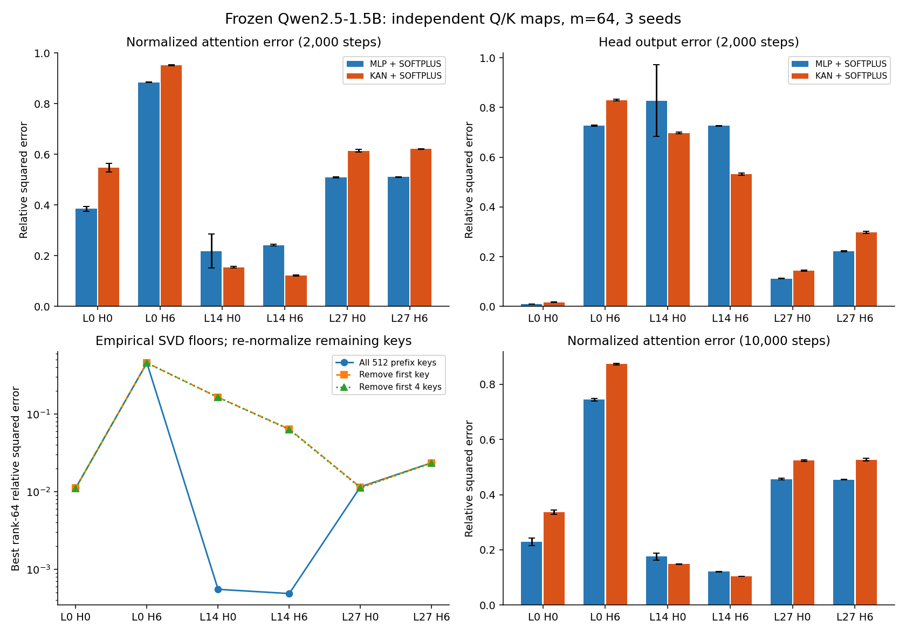
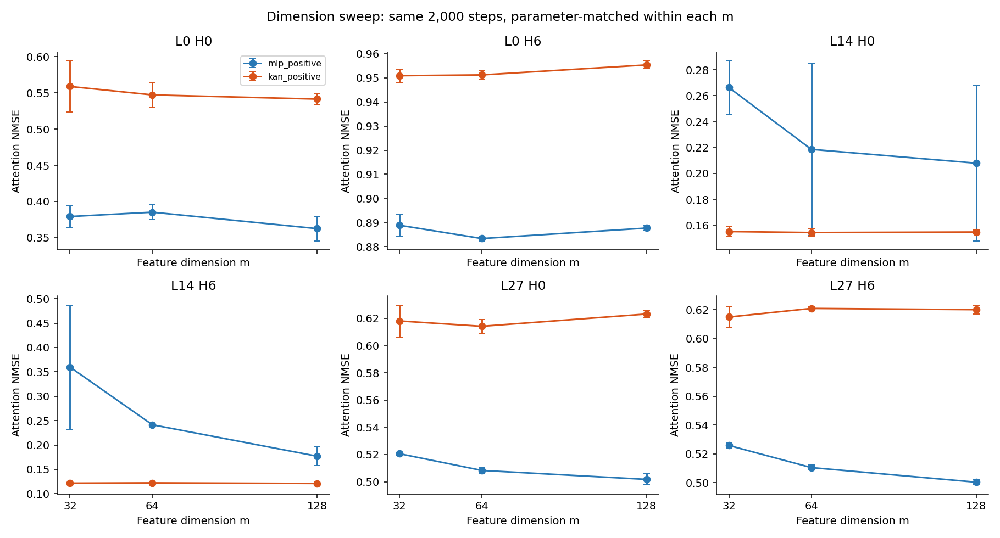
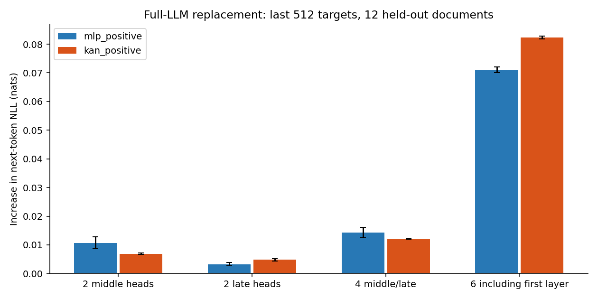

**辅助对照归档：归一化目标及早期 raw 实验（2026-09-05）。** 用户已明确主问题是直接拟合指数核。本文件保留早期辅助实验的完整结果，其中 row-target 结果不能用于判断用户方案是否成立。主要结论请看 `RAW_REPORT.zh.md`。本报告的数值来自本机冻结 Qwen2.5-1.5B 的实际实验，没有使用子 agent。

**当前证据支持分 head 研究，不支持“KAN 普遍优于现有线性 kernel”。** 在相同参数量和 2,000 步训练下，softplus-KAN 在两个被测中层 head 上优于 softplus-MLP，但首层、末层的四个 head 均落后。原始指数核拟合、去除 sink 后的谱、10,000 步训练和完整模型局部替换分别检验了目标尺度、谱结构、优化预算和实际预测质量。所有模型仅训练特征映射，LLM 权重冻结。

实验使用 [Qwen2.5-1.5B 官方权重](https://huggingface.co/Qwen/Qwen2.5-1.5B)，revision `8faed761d45a263340a0528343f099c05c9a4323`。Q/K 在投影和 RoPE **之后**截取，维度 128，缩放为 $1/\sqrt{128}$；使用正确的 GQA query-head → KV-head 映射。保存原始 BF16 张量。五个采样层的 Float32 手算注意力输出与原 SDPA 输出的相对 L2 差异为 0.094%–0.198%，符合不同精度计算的差异。

| 用途 | 文档数 | 每篇 token 数 | 来源 |
| --- | --- | --- | --- |
| 训练 | 64 | 1024 | WikiText 文档级 train |
| 验证 | 12 | 1024 | WikiText 文档级 validation |
| 测试 | 20 | 1024 | WikiText 文档级 test |
| 较长上下文测试 | 8 | 2048 | 另外的 WikiText test 文档 |
| 文体变化测试 | 8 | 1024 | 本地 LEval narrative QA 的正文 |

总计 112 篇、122,880 个 token 位置。文档文本哈希和 token 哈希均跨上述分组去重。模型预训练是否见过这些正文未知；“held-out”指没有进入本次特征映射训练。长文本组同时改变了文档和长度，不能把误差变化全部因果归于位置外推。验证时只用前 6 篇选择每个 head 的 checkpoint；全部 12 篇验证文档均有最终指标。

分布与谱覆盖层 0/7/14/21/27、每层 head 0/3/6/9，共 20 个 head；训练覆盖层 0/14/27 的 head 0/6，共 6 个 head。所有层、head 编号均从 0 开始。每个 head 独立训练 Q 和 K 两个网络，三随机种子为 11、29、47。

**真实分布的重要发现。** 以最后 512 个 query 和最前 512 个 key 形成完全合法的矩形注意力块，在 12 篇测试文档上做 SVD。raw kernel 先减去整个矩阵的最大 logit 再指数化，保留相对 Frobenius 误差；row kernel 在这个 512-key 块内逐行归一化。下表的 rank-64 floor 是平方奇异值尾和除以总能量。

| head | 高斯耦合最大奇异值 | raw floor | 归一化 floor | 删首 key 后归一化 floor |
| --- | --- | --- | --- | --- |
| L0-H0 | 0.579 | 3.65e-34 | 0.01111 | 0.01109 |
| L0-H6 | 4.051 | 8.51e-36 | 0.45522 | 0.45525 |
| L14-H0 | 0.824 | 0.000252 | 0.00055 | 0.16389 |
| L14-H6 | 0.838 | 0.000208 | 0.00049 | 0.06390 |
| L27-H0 | 0.610 | 0.00153 | 0.01153 | 0.01136 |
| L27-H6 | 0.624 | 0.00185 | 0.02357 | 0.02346 |

L14-H0 与 L14-H6 的第一 key 平均分别吸收该块约 89.9% 和 73.5% 的注意力质量。去掉第一 key 后，剩余注意力重新归一化，其谱尾大幅增加；这衡量剩余内容的条件拟合难度，并不等于原注意力矩阵的总体误差增长。删去前 4 或 16 个位置也给出相近现象，详见 `extra/sink_spectra.json`。

首层部分 head 的真实 logits 极大。例如采样因果 Q/K 对中，L0-H3 最大值约 24,245；L0-H0 平均值约 475。raw 平方误差因此可能几乎只奖励拟合少数最大元素，而归一化矩阵仍有明显谱尾。raw floor 在数值上接近 0 不能解释成精确有限秩，更不能推导注意力容易替换。

用训练样本均值和完整协方差拟合独立高斯时，20 个 head 中有 16 个不满足指数双线性核的 Hilbert–Schmidt 条件 $\|\beta\Sigma_q^{1/2}\Sigma_k^{1/2}\|_2<1/2$。此外，相同协方差并不能恢复真实归一化谱：L14-H0 的经验乘积分布 rank-64 floor 约 $1.63\times10^{-5}$，匹配高斯约 0.0321。这里的高斯只是替代分布，不能作为真实 Q/K 分布已被验证的依据。

**特征映射与拟合目标。** KAN 是两层三次 B-spline edge 网络，128→16→m，grid=8，带 SiLU base 分支；输入采用仅由训练集估计的逐通道均值/标准差。MLP 为 128→191→64（m=64 时），同样使用 SiLU，Q/K 网络彼此独立。每对 Q/K 网络分别有 73,888 与 73,854 个参数，差异小于 0.05%。KAN 的节点宽度较窄，固定 spline grid 不一定适配所有 head 的分布；这是一种具体实现的初验，不能排除其它 KAN 实现更好。

正值版本是 $f(q)=\operatorname{softplus}(F(q))$、$g(k)=\operatorname{softplus}(G(k))$，含等价的常数尺度；signed 版本使用 $1+F(q)$ 与 $1+G(k)$，输出不受符号限制。后者仍属于普通 KAN/MLP 输出函数类，常数平移只是初始化。优化为 AdamW，学习率 0.002 余弦降至 0.0002，每步选一篇训练文档、32 个因果 query、该文档全部 key，按 head 裁剪梯度。

训练了两个不同目标，不能混称：

1. **raw**：拟合 $\exp(q^\top k/\sqrt d-c_h)$，$c_h$ 是训练集核 RMS 对应的 head 常数；这是原始指数核的等价常数重缩放。训练损失为未加权的合法 Q/K 对平方误差。首层极端动态范围会造成数值退化，因此 raw 实验仅报告层 14/27 的四个 head。
2. **row**：拟合 $n_i\operatorname{softmax}(QK^\top/\sqrt d)_{ij}$，再用预测行和归一化。训练中按每个 minibatch/head 的目标能量归一化损失。这是注意力蒸馏的目标代表元，不是原始指数核的无权 L2 拟合；它还依赖文档与可见 key 集。

测试分别报告每篇文档的 kernel NMSE、attention NMSE 和 $AV$ 输出 NMSE，先在文档内计算能量比，再对文档取均值。表中“±”是三个随机种子各自测试均值的标准差，不是置信区间。全部因果指标在最后 512 个 query、所有合法前缀 key 上计算；SVD 对照则单独采用 first-512-key 矩形块，二者不直接相减。

**m=64、row 目标、2,000 步。** 数值越小越好。

| head | MLP attention | KAN attention | MLP output | KAN output |
| --- | --- | --- | --- | --- |
| L0-H0 | 0.3851 ± 0.0100 | 0.5473 ± 0.0177 | 0.0095 ± 0.0006 | 0.0168 ± 0.0005 |
| L0-H6 | 0.8833 ± 0.0009 | 0.9512 ± 0.0019 | 0.7265 ± 0.0021 | 0.8303 ± 0.0028 |
| L14-H0 | 0.2186 ± 0.0666 | 0.1543 ± 0.0028 | 0.8278 ± 0.1443 | 0.6977 ± 0.0026 |
| L14-H6 | 0.2415 ± 0.0029 | 0.1223 ± 0.0017 | 0.7264 ± 0.0017 | 0.5326 ± 0.0043 |
| L27-H0 | 0.5083 ± 0.0023 | 0.6141 ± 0.0051 | 0.1119 ± 0.0010 | 0.1442 ± 0.0017 |
| L27-H6 | 0.5105 ± 0.0016 | 0.6209 ± 0.0010 | 0.2212 ± 0.0022 | 0.2979 ± 0.0033 |

**m=64、row 目标、10,000 步。** 数值越小越好。

| head | MLP attention | KAN attention | MLP output | KAN output |
| --- | --- | --- | --- | --- |
| L0-H0 | 0.2293 ± 0.0143 | 0.3372 ± 0.0081 | 0.0061 ± 0.0005 | 0.0097 ± 0.0007 |
| L0-H6 | 0.7441 ± 0.0052 | 0.8728 ± 0.0025 | 0.6031 ± 0.0013 | 0.7597 ± 0.0028 |
| L14-H0 | 0.1759 ± 0.0124 | 0.1484 ± 0.0017 | 0.6985 ± 0.0276 | 0.6472 ± 0.0023 |
| L14-H6 | 0.1213 ± 0.0009 | 0.1041 ± 0.0006 | 0.5168 ± 0.0008 | 0.4880 ± 0.0021 |
| L27-H0 | 0.4563 ± 0.0036 | 0.5233 ± 0.0030 | 0.0990 ± 0.0007 | 0.1174 ± 0.0004 |
| L27-H6 | 0.4545 ± 0.0013 | 0.5269 ± 0.0040 | 0.1850 ± 0.0024 | 0.2319 ± 0.0015 |

10,000 步实验延长了优化并重新设置余弦学习率计划，验证集仍负责选择 checkpoint；它检查训练预算的敏感性，不构成“已找到各网络最优解”的证明。相同参数量/训练步数不等于相同 FLOPs 或训练时间。

**直接拟合 raw 指数核，2,000 步。**

| head | MLP kernel | KAN kernel | MLP attention | KAN attention |
| --- | --- | --- | --- | --- |
| L14-H0 | 0.9145 ± 0.0074 | 0.9208 ± 0.0040 | 0.2309 ± 0.0100 | 0.2671 ± 0.0549 |
| L14-H6 | 0.8163 ± 0.0014 | 0.8144 ± 0.0025 | 0.2103 ± 0.0136 | 0.2582 ± 0.0587 |
| L27-H0 | 0.9491 ± 0.0351 | 0.8978 ± 0.0027 | 0.9423 ± 0.0151 | 0.8615 ± 0.0183 |
| L27-H6 | 0.9198 ± 0.0125 | 0.8939 ± 0.0132 | 0.9020 ± 0.0189 | 0.8716 ± 0.0154 |

这些 raw 结果没有显示已经接近 rank-m 理论极限，也没有显示普遍优于 row 目标。需要区分原始尺度、训练优化、网络表达、正值限制和共享映射的跨文档泛化，不能把全部误差归因于 m 太小。

**维度扫描，2,000 步。** 每个 m 内匹配 KAN 与 MLP 参数量；跨 m 参数量变化，因此不是纯粹固定参数预算实验。

| head | MLP m=32/64/128 | KAN m=32/64/128 |
| --- | --- | --- |
| L0-H0 | 0.379 / 0.385 / 0.362 | 0.559 / 0.547 / 0.542 |
| L0-H6 | 0.889 / 0.883 / 0.888 | 0.951 / 0.951 / 0.955 |
| L14-H0 | 0.266 / 0.219 / 0.208 | 0.155 / 0.154 / 0.155 |
| L14-H6 | 0.360 / 0.241 / 0.177 | 0.122 / 0.122 / 0.121 |
| L27-H0 | 0.521 / 0.508 / 0.502 | 0.618 / 0.614 / 0.623 |
| L27-H6 | 0.526 / 0.510 / 0.500 | 0.615 / 0.621 / 0.620 |

KAN 在这个训练预算下随 m 增大的收益很小，提示不能单靠扩大输出维度解决当前瓶颈；可能的原因包括较窄的中间层、固定 grid、优化和分布变化，需要后续消融区分。

**稳定性与基线。** signed 特征出现了负核条目和非正分母。row-KAN 在 L0-H6 的 kernel NMSE 约 0.943，但归一化 attention NMSE 约 46.75；raw-signed 中若干 head 更严重。因此，“去掉 softplus 后不受非负秩限制”不能自动转化为更好的线性注意力。用 per-entry ReLU 修补 signed 核通常会破坏可分离低秩结构，不是免费的修复。

| 基线，m=64（如适用） | L0-H0 | L0-H6 | L14-H0 | L14-H6 | L27-H0 | L27-H6 |
| --- | --- | --- | --- | --- | --- | --- |
| uniform | 0.964 | 0.999 | 0.998 | 0.997 | 0.933 | 0.912 |
| first_token | 27.773 | 2.003 | 0.397 | 0.794 | 50.362 | 65.821 |
| positive_orthogonal_random_features | 24.566 | 1.880 | 0.402 | 0.661 | 7.589 | 10.028 |
| Hedgehog-style | 0.678 | 0.951 | 0.568 | 0.710 | 0.640 | 0.620 |

Hedgehog-style 使用拼接 softmax(Wx) 与 softmax(-Wx) 的可学习特征，只有 8,256 个参数/对，未匹配 KAN 参数量，也没有复现原论文完整训练配方；它是特征形式对照。正交随机特征使用同一个 Gaussian ORF 投影构造 Q/K 指数特征，在 log-space 稳定求值，未训练且没有额外温度调参，是公式基线而非优化后的 FAVOR+ 系统。对应原始方法见 [Hedgehog](https://arxiv.org/abs/2402.04347) 与 [Performer](https://arxiv.org/abs/2009.14794)。本实验不能声称击败这些论文的完整结果。

**较长上下文与文体变化。** 下表为 2,000 步正值模型的 attention NMSE。

| head | MLP 2k-token | KAN 2k-token | MLP narrative | KAN narrative |
| --- | --- | --- | --- | --- |
| L0-H0 | 0.958 | 0.962 | 0.537 | 0.673 |
| L0-H6 | 1.001 | 1.004 | 0.897 | 0.952 |
| L14-H0 | 0.967 | 0.521 | 0.205 | 0.145 |
| L14-H6 | 0.847 | 0.428 | 0.266 | 0.147 |
| L27-H0 | 0.880 | 0.913 | 0.535 | 0.623 |
| L27-H6 | 0.896 | 0.987 | 0.529 | 0.618 |

三种种子均未参与这些测试集上的选参。较长上下文误差仍然很大，目前没有长上下文质量保持的证据。

**完整 LLM 的局部替换。** 将 2,000 步得到的正值网络插回 Qwen，自回归因果状态使用 $S_t=\sum_{j\le t}g(k_j)v_j^\top$、$z_t=\sum_{j\le t}g(k_j)$，输出 $f(q_t)^\top S_t/[f(q_t)^\top z_t]$。Q/K/V 与后续层的隐藏状态随替换重新计算。累加实现与稠密特征核计算的相对 L2 误差为 $9.78\times10^{-7}$。

使用同一批 12 篇测试文档；原模型完整 1023 个预测位置的 PPL 为 **9.0480**，最后 512 个预测位置为 **8.7535**。这是本报告指定的小样本评估协议，不是标准全量 WikiText PPL。

| 替换范围，row 目标 | MLP 全位置 PPL | KAN 全位置 PPL | MLP 后512 PPL | KAN 后512 PPL |
| --- | --- | --- | --- | --- |
| middle | 9.1276 | 9.1012 | 8.8477 | 8.8141 |
| late | 9.0703 | 9.0794 | 8.7823 | 8.7955 |
| four_heads | 9.1531 | 9.1334 | 8.8797 | 8.8593 |
| six_heads | 9.8242 | 9.7503 | 9.3983 | 9.5050 |

middle/late 各替换 2 个 head；four_heads 替换中层和末层共 4 个；six_heads 再加首层 2 个。总模型有 336 个 query head，最多只替换其中 6 个。所有 query 位置都替换，包括未在训练 query 区间内的早期位置。完整位置和后半位置的结果可能排序不同，不能挑其中一种宣称普遍优越。

替换实验仍计算其余 head 的原始 SDPA，用于质量验证；没有测得生产级端到端加速。不能从少数 head 的小幅 PPL 差异推断整个模型能够无损线性化。

**计算成本。** RTX 3090，eager PyTorch Float32；每次特征计时包含 6 个独立 head 的 512 个 Q 与 512 个 K，不包括 attention scan。

| 方法 | 参数/每对 QK 网络 | 2,000 步训练秒数 | 特征映射毫秒 |
| --- | --- | --- | --- |
| mlp_positive | 73854 | 10.05 | 0.438 |
| kan_positive | 73888 | 22.71 | 2.855 |
| hedgehog | 8256 | 8.45 | 0.369 |

这些计时不是融合 kernel、BF16 推理或端到端吞吐基准。KAN 即使在局部 head 有误差优势，也必须面对特征计算开销；独立的 per-query-head K 映射还没有利用 GQA 共享来优化状态与计算。

**可以建立在真实模型上的数学框架。** 以下为推导，而非从拟合曲线猜测结论。

对 Qwen 这类 attention 前使用 RMSNorm 的冻结模型，令隐藏维度为 $D$，$z=\gamma\odot h/\sqrt{\|h\|_2^2/D+\epsilon}$，则 $\|z\|_2\le\sqrt D\|\gamma\|_\infty$。标准 RoPE 是正交变换，因此每个 head 满足 $\|q\|_2\le R_q:=\|W_q\|_2\sqrt D\|\gamma\|_\infty+\|b_q\|_2$，K 同理。于是 $\kappa(q,k)^2\le\exp(2\beta R_qR_k)$，真实乘积分布上的核必属于 $L^2(P_q\times P_k)$。常数可能很松且极大，但存在性成立。高斯替代模型发生发散，不意味着真实模型的算子发散。此结论针对这里核实的 RMSNorm 与标准 RoPE 架构，不能无条件推广到任意 Q/K 生成方式。

在明确指定的真实边缘乘积分布上，定义 $Tf(q)=\int\kappa(q,k)f(k)\,dP_k(k)$。Schmidt 分解 $\kappa=\sum_{r\ge1}\sigma_r u_rv_r$ 存在，并有 $E_m=\inf_{f_r,g_r}\mathbb E[(\kappa-\sum_{r=1}^m f_rg_r)^2]=\sum_{r>m}\sigma_r^2$。离散经验分布有权重时，应分解 $\operatorname{diag}(\sqrt w_q)K\operatorname{diag}(\sqrt w_k)$；等权情形即普通 SVD 的相应常数缩放。

实际训练的 Q/K 来自同一文档，且受因果位置约束，通常不是整个数据池中独立抽取的 $P_q\times P_k$。因此必须区分：跨文档乘积分布理论、条件于文档的算子，以及真实因果配对损失。任意非可分离配对权重下，普通 SVD 尾和不再自动等于全局最优风险。本实验额外计算经验乘积分布的谱，同时只对完全合法的矩形块使用无条件正确的矩阵秩下界。

对每篇文档矩形块 $A_C$，有 $\|A_C-\widehat A_C\|_F^2\ge\sum_{r>m}\sigma_r(A_C)^2$。对文档平均后仍给出共享特征映射的下界，但它允许每篇文档单独选择 SVD 因子，可能很松。逐行归一化不增加一个已拟合矩形低秩核的秩；因果三角 mask 则可能增加整个矩阵的秩，所以不能直接把 masked attention 的 SVD 当作线性状态维度下界。

正值特征约束给出 $E_m\le E_m^+\le\inf_{\theta_q,\theta_k}R(\operatorname{softplus}(\mathrm{KAN}_{\theta_q}),\operatorname{softplus}(\mathrm{KAN}_{\theta_k}))$。$E_m^+$ 是非负可分离逼近的 infimum，不由普通 SVD 完全决定。此次 signed 训练的结果既不是 $E_m$ 的估计，也不是非负约束代价的严格测量：网络容量、训练优化和归一化稳定性同时变化了。

KAN 的实例化应针对最优因子 $F_*=(\sqrt{\sigma_r}u_r)_{r\le m}$、$G_*=(\sqrt{\sigma_r}v_r)_{r\le m}$ 的可逼近性。若对应 $L^2$ 向量误差分别为 $\epsilon_q,\epsilon_k$，则一个可用的保守界是 $R(\widehat F,\widehat G)^{1/2}\le\sqrt{E_m}+\sqrt{\sigma_1}(\epsilon_q+\epsilon_k)+\epsilon_q\epsilon_k$。若这些奇异函数具有平滑、低宽度的可组合结构，KAN spline 逼近可控制后面两项；必须明确覆盖的输入域、平滑度、宽度、网格和尾部能量。不能仅引用 Kolmogorov–Arnold 表示定理就声称避免维数灾难。

对本次固定网格 KAN，还不能实证断言某个 spline 渐近阶数；目前只扫描了输出维度，没有扫描 grid 并验证最优奇异函数的可组合性。MLP、可学习随机特征与其它自适应方法也可能逼近相同因子。任何固定 m 方法都受同一无约束谱尾下界限制，KAN 的合理优势只能是特定因子类中的参数效率、优化或泛化，而不是突破这个极限。

真实数据提示更值得推进的对象是：保留小规模 sink/局部精确分支，对剩余内容构建按层和 head 的条件算子谱，再学习满足输出稳定性的特征。这样的结构本身不能算 KAN 独有创新；应证明并验证 KAN 在哪些实际观测到的奇异函数结构上更省参数或更易训练。

**顶会潜力的当前判断。** “两个 KAN 拟合 exp(QK) + 常规 SVD 下界”目前不足以形成有说服力的顶会主张。本实验没有发现全面效果优势，而且发现了 sink 对谱估计的影响、raw 目标失衡、signed 分母不稳和较长上下文误差。它们可以帮助形成更扎实的问题定义，但 attention sink、可学习特征映射和谱截断本身都有既有研究，不能包装成新发现。

若继续投入，优先做三项有判别力的工作：第一，在第二个模型家族及更多 head 上验证谱与 KAN 相对收益的可预测关系；第二，采用合法的正值分解或显式稳定约束，配合 sink 分支与 attention-output 蒸馏，并把 MLP/原始学习特征方法调到相近计算预算；第三，证明一个可在真实 Q/K 上检验的结构性假设对应的 KAN 逼近优势，同时给出全模型、长上下文任务和融合实现的质量—成本曲线。得到这些证据后再评估顶会竞争力，比现在预设 KAN 会更好可靠。

**复现与完整性。** 环境为 `/root/autodl-tmp/conda-envs/nonlinear-qk/bin/python`，PyTorch 2.13.0+cu130、Transformers 5.16.1；RTX 3090。绘图脚本使用 `/root/miniconda3/bin/python` 的 NumPy/Matplotlib。所有随机种子、训练曲线、各文档指标、选中 checkpoint 与模型 revision 均已保存。

已完成 45 次 feature-pair 配置/种子训练；每次含 4 或 6 个彼此独立 head。已检查 2952 个“同一矩形块学生误差 ≥ SVD 下界”的比较，违反数为 0（容差 $10^{-5}$）。文档哈希和 token 哈希去重均通过。相关比较不构成人口分布上的有限样本置信证书。

复现入口与产物：`extract_qkv.py` 保存真实 QKV；`analyze_distribution.py` 分析分布与谱；`fit_features.py` 训练及评估；`extra_diagnostics.py` 去 sink 与基线；`model_replacement.py` 做完整模型局部替换；`run_followups.py` 顺序运行后续 GPU 实验；`summarize_results.py` 与 `write_report.py` 生成汇总。`data_qwen25_1p5b/manifest.json` 记录全部文档来源和哈希，`results/metrics.csv` 是完整对比表，`results/summary.json` 包括按文档配对 bootstrap（条件于三个已训练种子，探索性未做多重比较修正）。

