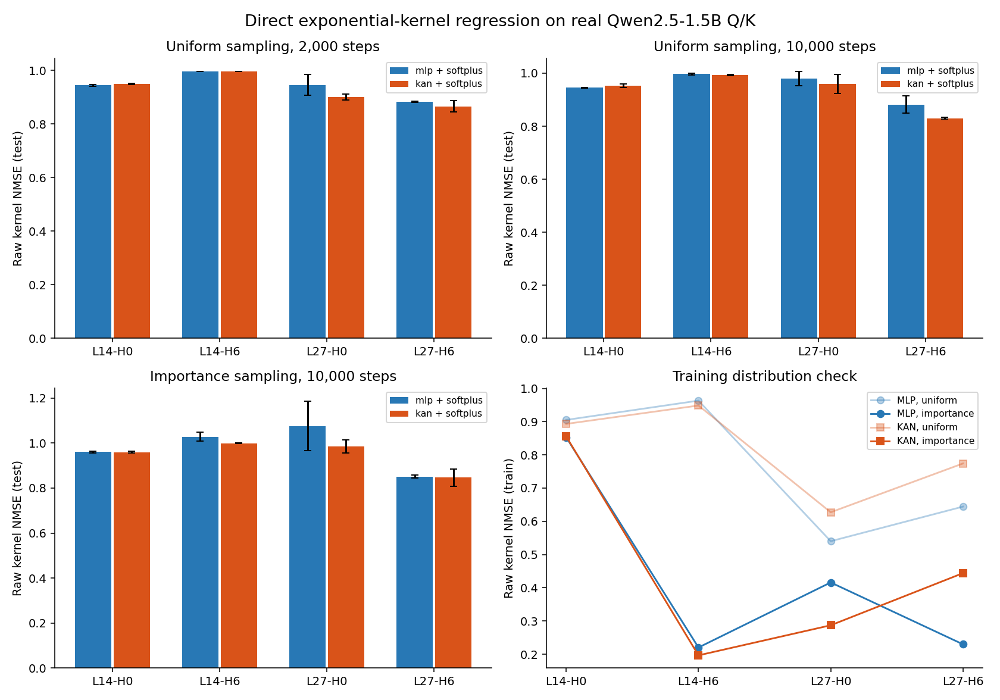
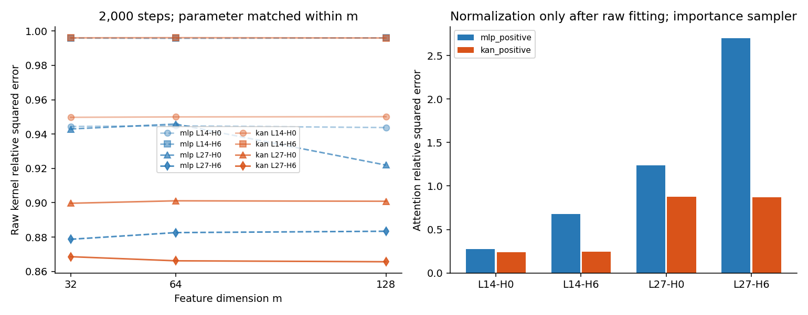

**主报告：在真实 Qwen2.5-1.5B 的 Q/K 上直接拟合指数核。** 本次主实验严格采用用户指定的目标：两个特征网络的内积拟合 $e^{q^\top k}$，归一化只交给 Linear Attention 的分母。此前 row-normalized-target 实验归档在 `AUXILIARY_REPORT.zh.md`，不作为本方案成立与否的证据。

**本轮没有验证出 KAN 的普遍优势。** 普通采样 10,000 步后，正值 KAN 在部分 head 的 raw 测试误差低于参数匹配的 MLP，但四个 head 的误差仍约 0.83–0.99。重要性采样改善了部分训练风险，却没有带来一致的测试改善。m 扫描、原始核 SVD、完整模型局部替换和数值精度对照都已完成；这些结果支持继续研究分布和泛化瓶颈，尚不足以支持优于现有论文的主张。

实际模型的注意力 logit 为 $q^\top k/\sqrt{128}$。等价地定义 $\widetilde q=128^{-1/4}q,\widetilde k=128^{-1/4}k$，本实验拟合的正是 $\kappa=e^{\widetilde q^\top\widetilde k}$。若把未缩放的原始 Q/K 直接代入 $e^{q^\top k}$，那会是不同于该 LLM 的温度，本报告没有将两者混淆。

数值上训练 $\kappa_c=e^{q^\top k/\sqrt d-c_h}$，其中 $c_h$ 是整个 head 共用、由训练集固定的常数，不依赖 query、key、文档或行和。最终函数为 $\widehat\kappa=e^{c_h}f(q)^\top g(k)$，所以损失只是原始核平方误差乘以固定常数；Linear Attention 的分子和分母都含 $e^{c_h}$，它会精确抵消。训练采用原始核平方误差；报告中的相对能量比仅用于评估和选择 checkpoint。

**数据与实现。** 模型为 [官方 Qwen2.5-1.5B](https://huggingface.co/Qwen/Qwen2.5-1.5B)，revision `8faed761d45a263340a0528343f099c05c9a4323`，冻结全部 LLM 权重。截取真实投影后、RoPE 后的 BF16 Q/K/V，使用正确 GQA 映射。覆盖 20 个 head 的分布；主训练选择 L14-H0、L14-H6、L27-H0、L27-H6 四个 head，编号从 0 开始。首层部分 head 的原始 logit 超过 2 万，普通浮点数下直接 raw-L2 训练会严重退化，本轮未把首层纳入主训练，也不声称解决了这个问题。

| 分组 | 文档 | 长度 | 用途 |
| --- | --- | --- | --- |
| WikiText train | 64 | 1024 | 仅特征网络训练 |
| WikiText validation | 12 | 1024 | 前6篇选择 checkpoint |
| WikiText test | 20 | 1024 | 独立测试 |
| 另选 WikiText test | 8 | 2048 | 较长上下文 |
| LEval narrative 正文 | 8 | 1024 | 文体变化 |

共 112 篇、122,880 token 位置，文本与 token 哈希跨分组去重。这是本次特征训练的 held-out 划分，不保证 LLM 预训练从未见过正文。主风险使用真实同文档因果 Q/K 对；高斯和跨文档独立乘积分布只用于理论诊断。

KAN：两层三次 B-spline edge 网络，128→16→m，grid=8，带 SiLU base 分支。MLP 使用 SiLU，m=64 时为 128→191→64。两支网络彼此独立；Q/K 输入采用训练集估计的逐通道均值/标准差，目标仍由原始 Q/K 计算。正值版本在输出使用 softplus，signed 版本不限制符号。m=64 时，每对网络参数分别为 KAN 73,888、MLP 73,854。固定网格、较窄中间层和单一学习率均属于此初验的限制。

**评估口径。** 主指标 $\mathrm{NMSE}_{raw}=\sum_{C,i,j}(\widehat\kappa_{Cij}-\kappa_{Cij})^2/\sum_{C,i,j}\kappa_{Cij}^2$，所有纳入评估的文档共用同一个 $c_h$。先汇总能量再取比值；逐文档比值的平均只作为辅助列。测试 query 是最后 512 个位置，key 为全部合法前缀。验证也按 pooled raw 平方误差选择 checkpoint。训练不用 Linear Attention 分母；attention、$AV$ 和完整模型 PPL 仅在训练完成后计算。表中 ± 为三个种子的标准差。
最终离线表格统一用 Float64 计算已训练特征与真实指数核，Linear Attention 直接除以实际行和，未加 epsilon 或截断分母。参数不变；checkpoint 仍由原来的 Float32 训练验证选出。早期含小分母保护的离线评估另存于 `legacy_float32_evaluation_backup/`，本报告不使用那些 attention/AV 数值。完整 LLM 的 Float32 与 Float64 替换试验分别报告。

**普通采样，2,000 步：原始核拟合误差。**

| head | MLP pooled raw NMSE | KAN pooled raw NMSE | MLP逐文档均值 | KAN逐文档均值 |
| --- | --- | --- | --- | --- |
| L14-H0 | 0.9448 ± 0.0036 | 0.9500 ± 0.0021 | 0.9149 | 0.9206 |
| L14-H6 | 0.9958 ± 0.0002 | 0.9961 ± 0.0002 | 0.8170 | 0.8252 |
| L27-H0 | 0.9458 ± 0.0385 | 0.9011 ± 0.0110 | 1.0447 | 0.9101 |
| L27-H6 | 0.8826 ± 0.0020 | 0.8662 ± 0.0203 | 1.0199 | 0.9201 |

**普通采样，10,000 步：原始核拟合误差。**

| head | MLP pooled raw NMSE | KAN pooled raw NMSE | MLP逐文档均值 | KAN逐文档均值 |
| --- | --- | --- | --- | --- |
| L14-H0 | 0.9450 ± 0.0022 | 0.9531 ± 0.0061 | 0.9113 | 0.9229 |
| L14-H6 | 0.9966 ± 0.0034 | 0.9942 ± 0.0022 | 0.8841 | 0.8430 |
| L27-H0 | 0.9791 ± 0.0274 | 0.9592 ± 0.0358 | 1.1172 | 0.9413 |
| L27-H6 | 0.8819 ± 0.0320 | 0.8296 ± 0.0035 | 0.9593 | 1.0126 |

**重要性采样，10,000 步：原始核拟合误差。**

| head | MLP pooled raw NMSE | KAN pooled raw NMSE | MLP逐文档均值 | KAN逐文档均值 |
| --- | --- | --- | --- | --- |
| L14-H0 | 0.9602 ± 0.0039 | 0.9596 ± 0.0049 | 0.9337 | 0.9363 |
| L14-H6 | 1.0286 ± 0.0195 | 0.9987 ± 0.0017 | 3.0965 | 0.9184 |
| L27-H0 | 1.0760 ± 0.1099 | 0.9856 ± 0.0289 | 1.0615 | 0.9128 |
| L27-H6 | 0.8506 ± 0.0066 | 0.8462 ± 0.0377 | 0.9184 | 0.9068 |

重要性采样没有更改拟合函数或目标风险。它以训练核平方能量与均匀分布的 50:50 混合分布抽取文档，再用类似的条件分布抽取 query；每个被抽 query 仍与该文档全部合法 key 配对，并乘以目标分布/提议分布的精确比值。四个 head 各自采样。普通采样使用同一篇随机文档和均匀 query，重要性版本另用完整训练对计算 head 常数，数值条件有所不同。两者都优化 raw L2；不能把所有变化纯因果归于某一个实现细节。

设 $\pi_h(C,i)=\pi_h(C)\pi_h(i\mid C)$，每文档合法训练对数为 $N_p$，文档数为 $D$，则采样损失为 $\frac1B\sum_{b=1}^B\frac{\sum_{j\le i_b}(\widehat\kappa_c-\kappa_c)^2}{D N_p\pi_h(C_b,i_b)}$，其期望等于原始合法对的均匀平方误差。采样实现已校验常数被积函数的精确期望，以及核平方能量的 Monte Carlo 期望；具体误差保存于每次训练 JSON 的 `sampler_verification`。

**训练集误差检查。** 用同一套最终 checkpoint，在训练文档最后 512 个 query 上重新评估；它帮助区分优化/表示困难和跨文档泛化，不能单独区分网络表达与优化。

| head | 普通 MLP | 普通 KAN | 重要性 MLP | 重要性 KAN |
| --- | --- | --- | --- | --- |
| L14-H0 | 0.9051 | 0.8931 | 0.8528 | 0.8552 |
| L14-H6 | 0.9632 | 0.9485 | 0.2202 | 0.1965 |
| L27-H0 | 0.5401 | 0.6272 | 0.4159 | 0.2870 |
| L27-H6 | 0.6442 | 0.7740 | 0.2298 | 0.4439 |

**m=32/64/128 的原始核实验，2,000 步。**

| head | MLP 32/64/128 | KAN 32/64/128 |
| --- | --- | --- |
| L14-H0 | 0.9444 / 0.9448 / 0.9438 | 0.9497 / 0.9500 / 0.9501 |
| L14-H6 | 0.9959 / 0.9958 / 0.9960 | 0.9960 / 0.9961 / 0.9959 |
| L27-H0 | 0.9429 / 0.9458 / 0.9219 | 0.8997 / 0.9011 / 0.9009 |
| L27-H6 | 0.8787 / 0.8826 / 0.8834 | 0.8686 / 0.8662 / 0.8656 |

每个 m 内参数匹配，跨 m 参数数量变化。不能把这个小规模扫描解释为已经测到 KAN 的渐近最优逼近率。

**同一原始核目标的基线。** 常数为训练集核均值；正交正值随机特征包含 Q 和 K 两侧的完整范数项，m=64，三种子。mean-centered 版本使用训练均值中心化，并精确补回两个可分离边缘指数因子，仍估计同一个原始核，没有更改目标。

| 方法 | L14-H0 | L14-H6 | L27-H0 | L27-H6 |
| --- | --- | --- | --- | --- |
| train_mean_constant | 0.9996 | 0.9999 | 0.9983 | 0.9987 |
| positive_orthogonal_random_features | 1.0000 | 1.0000 | 1.0000 | 1.0000 |
| mean_centered_positive_ORF | 1.0202 | 3.3858 | 4.3295 | 409.7412 |

随机特征只做公式级原始核对照，并非复现某篇论文的完整调优系统。三次投影不能准确估计高方差随机特征的总体风险。

**原始核的 SVD 下界。** 对完全合法的 512×512 矩形块做 SVD；这里只使用 raw 指数矩阵，归一化谱不作为替代。下表的 oracle 和学生误差使用相同 12 篇测试文档、相同块和相同 head 常数，按原始能量加权汇总。oracle 允许每篇文档单独挑选自由 rank-64 因子，学生需要共享 KAN/MLP 函数，因此 oracle 下界可能很松。

| head | 经验自由 rank-64 下界 | 重要性 MLP块误差 | 重要性 KAN块误差 |
| --- | --- | --- | --- |
| L14-H0 | 0.000334 | 0.669629 | 0.700718 |
| L14-H6 | 0.000005 | 1.004463 | 0.998453 |
| L27-H0 | 0.000164 | 0.852336 | 0.831469 |
| L27-H6 | 0.000070 | 0.919933 | 0.901773 |

已检查 1728 个对应的 raw 矩形块误差与 SVD floor，违反数为 0（容差 1e-5）。这只是经验矩阵下界，不是无限总体分布最小误差的置信证书，也没有证明训练后的网络达到了其类内最优。

**拟合完成后，才使用 Linear Attention 分母。** 下表采用 10,000 步重要性采样的 raw 模型，attention 与 output NMSE 为逐文档能量比的平均。

| head | MLP attention | KAN attention | MLP AV | KAN AV |
| --- | --- | --- | --- | --- |
| L14-H0 | 0.2766 | 0.2393 | 0.9558 | 0.8817 |
| L14-H6 | 0.6749 | 0.2431 | 1.7033 | 0.7773 |
| L27-H0 | 1.2367 | 0.8788 | 0.3368 | 0.2703 |
| L27-H6 | 2.7000 | 0.8706 | 0.7989 | 0.4733 |

**KAN 输出是否使用 softplus，2,000 步 raw 目标。** signed 版本放宽了非负约束，却可能发生核条目为负、分母接近零或非正。以下均用严格分母的 Float64 离线评估。

| head | signed KAN raw误差 | softplus KAN raw误差 | signed KAN attention误差 | softplus KAN attention误差 |
| --- | --- | --- | --- | --- |
| L14-H0 | 0.95171 | 0.94997 | 15221 | 0.24957 |
| L14-H6 | 0.99636 | 0.99609 | 17952 | 0.23298 |
| L27-H0 | 0.90784 | 0.90112 | 3506.8 | 0.86131 |
| L27-H6 | 0.89234 | 0.86619 | 585 | 0.87225 |

raw L2 好坏与归一化后的稳定性是两个不同问题。负核条目、非正分母比例等完整指标见 `raw_results/metrics.csv`。

**完整模型局部替换（replacement_raw_longer，特征精度 float32）。** 替换 336 个 query head 中的 4 个，其余保持原始注意力，冻结 LLM，不做微调。12 篇指定测试文档的原模型全位置 PPL 为 9.0480，后 512 预测位置 PPL 为 8.7535。

| 方法 | 全位置 PPL均值±种子标准差 | 后512 PPL均值±种子标准差 |
| --- | --- | --- |
| mlp_positive | 仅 1/3 种子完成；不汇总比较 | 仅 1/3 种子完成；不汇总比较 |
| kan_positive | 9.1580 ± 0.0018 | 8.9021 ± 0.0024 |

以下配置在 Float32 正值特征累加中出现非正分母，已记录为失败；表中仅汇总三个种子都完成的情况：raw_mlp_positive_s29_four_heads：Nonpositive denominator in positive feature scan; zero_query_feature_rows=2; zero_key_feature_rows=3；raw_mlp_positive_s47_four_heads：Nonpositive denominator in positive feature scan; zero_query_feature_rows=0; zero_key_feature_rows=0。

**完整模型局部替换（replacement_raw_importance，特征精度 float32）。** 替换 336 个 query head 中的 4 个，其余保持原始注意力，冻结 LLM，不做微调。12 篇指定测试文档的原模型全位置 PPL 为 9.0480，后 512 预测位置 PPL 为 8.7535。

| 方法 | 全位置 PPL均值±种子标准差 | 后512 PPL均值±种子标准差 |
| --- | --- | --- |
| mlp_positive | 仅 0/3 种子完成；不汇总比较 | 仅 0/3 种子完成；不汇总比较 |
| kan_positive | 9.1634 ± 0.0045 | 8.9060 ± 0.0056 |

以下配置在 Float32 正值特征累加中出现非正分母，已记录为失败；表中仅汇总三个种子都完成的情况：raw_mlp_positive_s11_four_heads：Nonpositive denominator in positive feature scan; zero_query_feature_rows=0; zero_key_feature_rows=1；raw_mlp_positive_s29_four_heads：Nonpositive denominator in positive feature scan; zero_query_feature_rows=1; zero_key_feature_rows=0；raw_mlp_positive_s47_four_heads：Nonpositive denominator in positive feature scan; zero_query_feature_rows=1; zero_key_feature_rows=2。

**完整模型局部替换（replacement_raw_longer_fp64，特征精度 float64）。** 替换 336 个 query head 中的 4 个，其余保持原始注意力，冻结 LLM，不做微调。12 篇指定测试文档的原模型全位置 PPL 为 9.0480，后 512 预测位置 PPL 为 8.7535。

| 方法 | 全位置 PPL均值±种子标准差 | 后512 PPL均值±种子标准差 |
| --- | --- | --- |
| mlp_positive | 9.1872 ± 0.0145 | 8.9351 ± 0.0065 |
| kan_positive | 9.1574 ± 0.0013 | 8.8979 ± 0.0036 |

**完整模型局部替换（replacement_raw_importance_fp64，特征精度 float64）。** 替换 336 个 query head 中的 4 个，其余保持原始注意力，冻结 LLM，不做微调。12 篇指定测试文档的原模型全位置 PPL 为 9.0480，后 512 预测位置 PPL 为 8.7535。

| 方法 | 全位置 PPL均值±种子标准差 | 后512 PPL均值±种子标准差 |
| --- | --- | --- |
| mlp_positive | 9.1919 ± 0.0085 | 8.9499 ± 0.0056 |
| kan_positive | 9.1628 ± 0.0048 | 8.9043 ± 0.0044 |

累加状态的 Linear Attention 与稠密特征核输出已做数值对照；替换后重新计算后续隐藏状态。这里不是标准全量 WikiText PPL，也不是全模型线性化，更不是端到端速度测试。
Float64 复核只提高已训练特征网络和累加状态的计算精度，Qwen 主体仍为 BF16，没有重训或改变目标函数。它用于确认 Float32 下溢，不能当作高效推理方案。

**泛化与成本。**

| head | MLP 2048-token raw误差 | KAN 2048-token raw误差 | MLP narrative raw误差 | KAN narrative raw误差 |
| --- | --- | --- | --- | --- |
| L14-H0 | 1.7030 | 1.0377 | 0.9777 | 0.9766 |
| L14-H6 | 6.8814 | 1.0010 | 1.0352 | 0.9602 |
| L27-H0 | 1.0695 | 0.9985 | 0.9398 | 0.9073 |
| L27-H6 | 0.9642 | 1.0523 | 0.8675 | 1.0089 |

| 方法 | 参数/每对网络 | 普通10k训练秒 | 重要性10k训练秒 | 512 Q+512 K特征毫秒（4个head） |
| --- | --- | --- | --- | --- |
| mlp_positive | 73854 | 49.69 | 54.45 | 0.435 |
| kan_positive | 73888 | 120.99 | 115.93 | 2.079 |

RTX 3090、eager PyTorch Float32、未融合。相同参数量与训练步数不等于相同计算预算。较长测试组还更换了文档，不能把变化完全归因于长度。

**理论应如何接到真实分布。**

Qwen attention 前的 RMSNorm 给出 $\|z\|_2\le\sqrt D\|\gamma\|_\infty$，标准 RoPE 保持范数。因此 $\|q\|_2\le R_q:=\|W_q\|_2\sqrt D\|\gamma\|_\infty+\|b_q\|_2$，K 同理，$\kappa^2\le e^{2\beta R_qR_k}$。对该真实冻结模型的边缘乘积分布，Hilbert–Schmidt 算子与 Schmidt 分解确实存在，虽然这个范数上界可能极松。匹配高斯的 20 个 head 中 16 个违反指数核可积性条件，只说明高斯替代不合适，不能推断真实算子发散。

对明确指定的 $P_q\times P_k$，$\kappa=\sum_r\sigma_r u_rv_r$，自由 m 维双特征的最小平方误差为 $E_m=\sum_{r>m}\sigma_r^2$。softplus 特征再受非负可分离因子的限制，故 $E_m\le E_m^+\le\inf_{\mathrm{KAN}}R$。真实同文档因果 Q/K 配对通常不是这个全局乘积分布，不能直接套用同一 SVD 最优式；本报告使用每文档合法矩形块的下界，并把经验乘积分布谱单列在分布结果中。

KAN 的理论任务是逼近 $F_*=(\sqrt{\sigma_r}u_r)_{r\le m}$ 与 $G_*=(\sqrt{\sigma_r}v_r)_{r\le m}$。若两者的 $L^2$ 向量逼近误差为 $\epsilon_q,\epsilon_k$，则 $\sqrt{R}\le\sqrt{E_m}+\sqrt{\sigma_1}(\epsilon_q+\epsilon_k)+\epsilon_q\epsilon_k$。要进一步得到 spline 的收敛阶，必须证明这些奇异函数在真实支持域上有适合该 KAN 宽度/深度的平滑组合结构，并控制尾部能量、正值约束和优化误差。通用表示定理不能单独给出维数无关优势。
上述直接逼近 SVD 因子的界适用于允许符号的特征。softplus-KAN 不能直接逼近带负值的奇异函数；应先选取非负可分解近似，再分析它的非负因子。若通过 softplus 逆函数转换因子，还需要控制因子接近 0 时的正则性和常数，不能把 signed 的逼近率原样搬过去。本次没有求出 $E_m^+$，因此尚未分离出纯粹的非负约束代价。

对于原始指数核，均值、范数和极端 Q/K 对决定了 raw 能量的分布；只匹配协方差或归一化后的谱不够。可以进一步研究精确的可分离边缘因子、倾斜分布与重要性采样，这些必须保持原始风险的定义。它们也不是 KAN 独有优势，仍需与调优的 MLP、可学习特征及正值随机特征比较。

**课题评价。** 当前实验只验证了一种有限宽度固定网格 KAN 在一个真实模型四个 head 上的行为，尚不能支持“效果会比现有研究更好”。常规 SVD 下界加替换网络也不足以形成顶会新颖性。值得继续的主张应是：在可由真实 Q/K 检验的分布/奇异函数结构条件下，KAN 能以更小的参数或计算预算逼近原始指数核，并在稳定的 Linear Attention 分母下保留 LLM 质量。若优势只来自更长训练或改进采样，它就属于优化方法的贡献，不能直接归为 KAN 的理论优势。

后续最有判别力的实验是扩展第二个模型家族和更多 head，扫描 KAN 网格/宽度与 MLP 预算，测量训练与测试 raw 风险及尾部能量，并进行更多 head 的真实替换。已有归一化目标实验仅留作辅助，不用于替代这些证据。没有把本次小样本实验称为对 [Hedgehog](https://arxiv.org/abs/2402.04347) 或 [Performer](https://arxiv.org/abs/2009.14794) 整套方法的复现或超越。

**复现。** 全流程入口 `reproduce_raw.py`；主训练入口 `run_raw_followups.py`，重要性采样及审计入口 `continue_raw_pipeline.py`，单次训练入口 `fit_features.py --objective raw`；`raw_importance.py` 实现风险保持的采样器，`exact_raw_evaluation.py` 重算严格分母的 Float64 离线指标，`audit_raw.py` 验证增添其它 key 不改变既有 raw 目标、常数缩放可恢复原始指数核，并评估训练风险。`raw_results/summary.json`、`metrics.csv` 保留完整数值、按文档配对 bootstrap 与 SVD 检查。bootstrap 条件于三个已训练种子，为探索性分析，未做多重比较修正。模型、原始 QKV、所有 checkpoint、曲线和文档哈希都保留在本目录。

本主报告汇总 36 次配置/种子训练，每次同时训练四个独立 head。运行环境为 `/root/autodl-tmp/conda-envs/nonlinear-qk/bin/python`（torch 2.13.0+cu130、transformers 5.16.1）；绘图使用 `/root/miniconda3/bin/python summarize_raw.py`。

