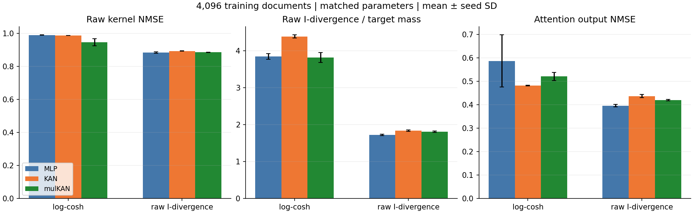
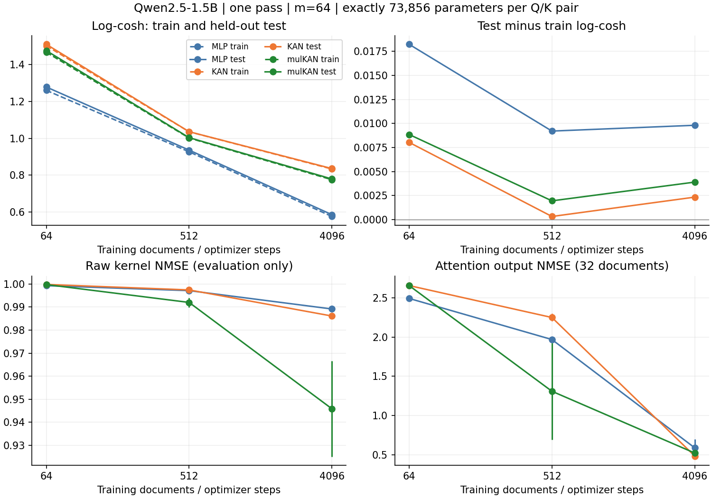

这轮实验已完成两层 KAN、两层 mulKAN 与两层 MLP 的严格等参数、单遍训练比较。结果没有支持“加入 KAN 或乘法就会全面超过 MLP”。数据增多有帮助，损失函数会改变结构排序；在更直接控制原始 kernel 质量的 I-divergence 对照中，应以表中的误差及完整模型替换结果判断。

**实验对象与公平性**

冻结 Qwen2.5-1.5B，使用真实投影、RoPE 后的 Q/K，head dimension=128，正确按 GQA 将 query head 映射到 KV head。比较第 14/27 层的 0/6 号 head。目标始终是

$$K(q,k)=\exp(q^\top k/\sqrt{128}),\qquad \widehat K=e^{c_h}\sum_{r=1}^{64}f_r(q)g_r(k),$$

其中两支网络独立，$f,g$ 为 softplus 正特征；$1/\sqrt{128}$ 是该 LLM 原有 attention scale，可吸收到 q、k 中。$c_h$ 是只用训练集计算的每 head 公共常数，所有 query 共用，未做逐行标签归一化。特征的固定缩放可同样吸收到网络中，不改变表达式的可分离结构。本轮按 softplus 正特征方案比较，未重复 signed-feature 方案。

| 模型 | 单支结构（小预算） | Q/K 两支合计有效参数 | 双倍预算 |
|---|---|---|---|
| MLP | 128→192→64，中间 SiLU | 73,856 | 147,584 |
| KAN | 128→16→64，两层 cubic B-spline+SiLU base | 73,856 | 147,584 |
| mulKAN | 128→(9加法+3二元乘法)→(32加法+32二元乘法) | 73,856 | 147,584 |

mulKAN 第一层先产生 15 个子节点，再组合为 12 个隐藏节点；第二层产生 96 个子节点，再组合为 64 个输出。两层都有乘法。每条 spline edge 含 11 个三次 B-spline 系数及 1 个 SiLU base 权重。三种结构统一无中间 bias、最终每支有 64 个 bias，所有计入的参数都参加前向计算，没有补零或闲置参数。双倍预算将 MLP/KAN 隐藏宽度加倍，mulKAN 第一层加法/乘法节点数加倍，最终 m=64 保持不变。

实现遵循 [MultKAN 原论文](https://arxiv.org/abs/2408.10205)和[官方 MultKAN 代码](https://github.com/KindXiaoming/pykan/blob/master/kan/MultKAN.py)的子节点乘积机制，是用于该实验的固定网格版本，没有引入 symbolic 分支。等参数并不等 FLOPs、吞吐或优化难度。

**数据量与“每条数据只训练一次”**

训练集为 4,096 篇文章的各 1,024 token 前缀，共 4,194,304 token，比旧 64 篇实验扩大 64 倍。前 64 篇保留旧训练文章，新增 4,032 篇；另有 128 篇验证、256 篇测试文章。新划分来自 [WikiText document-level 数据集](https://huggingface.co/datasets/EleutherAI/wikitext_document_level)的 WikiText-103 TRAIN split，是内部留出集，**不是官方 WikiText 测试集**。所有文档的文本和 token 哈希均去重；官方验证/测试及旧评估文档不进入新训练样本。

每篇取后半段 512 个 Q，与前半段 512 个 K 的固定随机排列一一配对，每个 Q、K 各使用一次，全部满足 causal 条件。因此每个 head 共 2,097,152 个唯一训练对，而非遍历每篇全部 512² 个组合。每篇只做一次梯度更新，每次运行只有 1 epoch，没有 replay、早停或测试集选 checkpoint。校准均值/方差、计算公共幅度及训练集误差会额外读取数据，但不做重复梯度训练。不同随机种子是独立重复实验，单遍约束逐次运行成立。

每一组使用同样的数据对和文档顺序，种子为 11/29/47；AdamW，lr 0.002→0.0002，weight decay=1e-4，按 head 梯度裁剪，使用最终 checkpoint。共 45 个配置运行，每次并行训练 4 个相互独立的 head 特征映射。KAN 网格固定为 8 段，没有按模型单独调学习率、初始化或网格；这些选择可能影响排序。

**更换后的损失：始终拟合未归一化 kernel**

令 $y=e^{q^\top k/\sqrt{128}-c_h}$，$\hat y=\sum_r f_r(q)g_r(k)>0$。程序通过 logsumexp 稳定计算 $\log\hat y$；不是先让特征内积拟合 logits 再在外面取 exp，后一种做法一般不再是线性 attention kernel。

1. 乘性误差 log-cosh：$L_{lc}=\log\cosh(\log\hat y-\log y)$。对 log-ratio 的梯度为 tanh，有界，避免原始平方误差被极大 kernel 值主导；代价是普通样本的相对误差改善，未必充分改善极少数大质量样本。
2. 未归一化广义 KL / I-divergence：$L_I=\hat y-y+y\log(y/\hat y)$。代码名为 `poisson`，仅借用其损失形式，不假设 kernel 是整数计数。训练省略只依赖 y 的常数，因此日志中的训练 loss 可以为负；评估报告的是恢复完整常数后的非负 divergence。

本轮**没有用原始 kernel 的 MSE 做训练**。NMSE 仅作为评估量，以保留和 L2/SVD 理论之间的联系。公共缩放 $e^{c_h}$ 不改变 log-cosh；对 I-divergence 只产生每 head 的固定权重，四个 head 的网络参数互不共享。

I-divergence 适合本问题的关键理由可以直接推导。对一行 kernel，记 $Z=\sum_jK_j$、$\hat Z=\sum_j\hat K_j$，$p=K/Z$、$\hat p=\hat K/\hat Z$，则

$$D_I(K\Vert\hat K)=Z\,D_{KL}(p\Vert\hat p)+Z\log(Z/\hat Z)-Z+\hat Z.$$

它同时惩罚行质量失配与归一化 attention 形状失配，但训练标签仍是原始 K。质量误差项 $Z\log(Z/\hat Z)-Z+\hat Z$ 非负，所以 $D_{KL}(p\Vert\hat p)\le D_I(K\Vert\hat K)/Z$；若每个 value 的范数不超过 V，则由 Pinsker 得 $\|\hat o-o\|\le V\sqrt{2D_I(K\Vert\hat K)/Z}$。这是逐行界；当前随机配对损失估计的是文档中合法矩形块的平均 entry risk，并不自动保证每一行都小。

**主要结果：4,096 篇、小参数预算**

| 训练损失 | 结构 | 测试 log-cosh↓ | 原始 kernel NMSE↓ | I-divergence/目标质量↓ | attention 输出 NMSE↓ |
|---|---|---|---|---|---|
| logcosh | MLP | 0.5858 ± 0.0033 | 0.9892 ± 0.0009 | 3.8381 ± 0.0762 | 0.5868 ± 0.1113 |
| logcosh | KAN | 0.8360 ± 0.0021 | 0.9861 ± 0.0007 | 4.3835 ± 0.0414 | 0.4821 ± 0.0010 |
| logcosh | mulKAN | 0.7794 ± 0.0137 | 0.9458 ± 0.0207 | 3.8151 ± 0.1332 | 0.5205 ± 0.0172 |
| 原始 I-divergence | MLP | 1.8450 ± 0.0409 | 0.8837 ± 0.0038 | 1.7227 ± 0.0197 | 0.3961 ± 0.0050 |
| 原始 I-divergence | KAN | 2.1746 ± 0.1064 | 0.8920 ± 0.0010 | 1.8355 ± 0.0146 | 0.4371 ± 0.0063 |
| 原始 I-divergence | mulKAN | 2.1453 ± 0.1354 | 0.8845 ± 0.0020 | 1.8028 ± 0.0191 | 0.4196 ± 0.0035 |

表中先在每个 head 内聚合，再对固定 4 个 head 求算术平均，± 为 3 个 seed 的样本标准差，不是置信区间。前三个指标使用 256 篇测试文档的 131,072 个唯一配对样本/head；输出 NMSE 使用前 32 篇测试文档的完整合法 512×512 矩形块。原始 kernel NMSE 为 pooled SSE/真实 kernel 平方和，I-divergence 除以真实 kernel 质量；输出 NMSE 先逐文档计算再平均。不同量的数值不可直接互相比较。

log-cosh 下 MLP 更好地拟合多数样本的乘性误差；KAN/mulKAN 对原始平方风险或输出误差的表现不完全沿用这一排序。I-divergence 在三种结构上都改变了这种权衡。原始 kernel NMSE 仍然很高，不能把改进描述为已经准确替代 softmax kernel。



**数据是否不足、是否过拟合**

| 训练文档数 | 结构 | 训练 log-cosh | 测试 log-cosh | 测试−训练 | 输出 NMSE |
|---|---|---|---|---|---|
| 64 | MLP | 1.2608 | 1.2790 | 0.0182 | 2.4917 |
| 64 | KAN | 1.5027 | 1.5108 | 0.0080 | 2.6557 |
| 64 | mulKAN | 1.4676 | 1.4764 | 0.0089 | 2.6557 |
| 512 | MLP | 0.9271 | 0.9363 | 0.0092 | 1.9677 |
| 512 | KAN | 1.0359 | 1.0362 | 0.0003 | 2.2486 |
| 512 | mulKAN | 1.0020 | 1.0040 | 0.0019 | 1.3082 |
| 4096 | MLP | 0.5760 | 0.5858 | 0.0098 | 0.5868 |
| 4096 | KAN | 0.8337 | 0.8360 | 0.0023 | 0.4821 |
| 4096 | mulKAN | 0.7755 | 0.7794 | 0.0039 | 0.5205 |

以 log-cosh 评价时，训练和测试误差都随规模增加而下降，差距较小，未出现“大幅压低训练误差、测试误差很差”的典型整体过拟合图景。这说明不能把问题简单归因于反复训练少量数据，数据覆盖、优化步数及结构/目标偏差仍需区分。

但是，对大值更敏感的风险仍有训练—测试差距。下面是 4,096 篇、I-divergence 训练的结果：

| 结构 | 训练 raw NMSE | 测试 raw NMSE | 训练 I-div/质量 | 测试 I-div/质量 |
|---|---|---|---|---|
| MLP | 0.8495 | 0.8837 | 1.2333 | 1.7227 |
| KAN | 0.8743 | 0.8920 | 1.4271 | 1.8355 |
| mulKAN | 0.8021 | 0.8845 | 1.3397 | 1.8028 |

mulKAN 的训练 raw NMSE 比 MLP 低，但测试时这一优势没有保留；这提示需要关注尾部泛化。该差距可能同时反映稀有样本的拟合偏差与有限测试集的尾部波动，不能仅凭小的平均 log-cosh gap 宣布没有过拟合，也不能仅凭两个集合的加权风险之差证明其原因一定是过拟合。

必须保留的混杂因素是：训练文档增加时，optimizer steps 也从 64 增至 4,096，学习率退火随总步数变化，训练集校准统计也变化。因此本实验回答的是“更多新数据、单遍训练是否有益”，没有分离纯数据量效应与优化预算效应；单遍训练既不保证不发生过拟合，也不保证已经收敛。旧 MSE 实验的采样与训练步数不同，不能与本表作只更换损失的严格消融。



**增大参数预算**

| Q/K 参数 | 结构 | 测试 log-cosh↓ | 原始 kernel NMSE↓ | 输出 NMSE↓ | 512对特征计算 ms↓ |
|---|---|---|---|---|---|
| 73856 | MLP | 0.5858 ± 0.0033 | 0.9892 ± 0.0009 | 0.5868 ± 0.1113 | 0.6457 |
| 73856 | KAN | 0.8360 ± 0.0021 | 0.9861 ± 0.0007 | 0.4821 ± 0.0010 | 2.2708 |
| 73856 | mulKAN | 0.7794 ± 0.0137 | 0.9458 ± 0.0207 | 0.5205 ± 0.0172 | 2.5452 |
| 147584 | MLP | 0.5348 ± 0.0044 | 0.9855 ± 0.0027 | 0.4390 ± 0.0432 | 0.6526 |
| 147584 | KAN | 0.7698 ± 0.0030 | 0.9773 ± 0.0029 | 0.4767 ± 0.0184 | 2.3135 |
| 147584 | mulKAN | 0.6992 ± 0.0121 | 0.9350 ± 0.0123 | 0.4964 ± 0.0051 | 2.5171 |

这里全部使用 log-cosh、4,096 篇、1 epoch，m 始终为 64。时间为 RTX 3090 上一次同时处理 4 个 head、每 head 512 对输入的 eager 特征网络+logsumexp 实测；不包括完整线性 attention，也不是 fused kernel 或端到端加速比较。参数匹配后，当前 spline 实现仍有显著计算开销。

**真实 kernel 的尾部与 SVD 对照**

| head (layer,index) | 最大 logit | 最大0.1%样本的质量占比 | 最大0.1%样本的平方能量占比 |
|---|---|---|---|
| [14, 0] | 6.00 | 58.97% | 90.74% |
| [14, 6] | 7.17 | 62.47% | 99.69% |
| [27, 0] | 12.72 | 34.30% | 98.56% |
| [27, 6] | 14.64 | 33.58% | 97.49% |

这里的分位数只描述本次真实 Q/K 样本，不假定高斯，也不将经验大值集中等同于严格意义的幂律分布。高平方能量集中解释了为什么 log-cosh、raw NMSE 和归一化后的输出会给出不同评价，以及为什么有限测试样本的 raw NMSE 会敏感。

| head | signed rank-64 SVD相对下界 | I-div MLP实际NMSE | I-div KAN实际NMSE | I-div mulKAN实际NMSE |
|---|---|---|---|---|
| [14, 0] | 2.954e-03 | 0.7595 | 0.7683 | 0.7629 |
| [14, 6] | 9.787e-04 | 0.9892 | 0.9900 | 0.9891 |
| [27, 0] | 2.676e-04 | 0.8684 | 0.8869 | 0.8287 |
| [27, 6] | 3.399e-04 | 0.8706 | 0.8822 | 0.8526 |

上述下界与实际误差使用同一组 32 个 512×512 测试块，按真实 kernel 平方能量聚合。SVD 可使用该测试块本身任意构造有符号因子，是逐块 oracle；我们的网络必须从训练数据学习、在不同文档共享函数，并具有非负因子。因此接近零的 oracle 下界不说明当前正特征模型能够达到它，也不能把实际误差与该下界之差全部归因于优化失败。它更不是全局 $P_q\otimes P_k$ 的总体最优风险证明。

对任意 m 维可分离表示，矩形预测矩阵的秩仍然至多为 m。mulKAN 的乘法发生在单侧特征网络内部，可以更直接构造坐标交互，却不会突破该秩限制。I-divergence 和 log-cosh 改变了优化目标，Schmidt 奇异值尾和只给 L2 评估的最优秩下界，不能原封不动称为这两个新损失的最小误差。要证明 mulKAN 特有优势，需要针对真实分布的主导特征函数给出相同参数或计算预算下更好的逼近率，再控制采样和优化误差；通用逼近定理本身不够。

**完整 LLM 的四个 head 替换验证**

| 损失 | 模型 | 困惑度 ± seed SD | 相对原模型 ΔNLL | 后512位置困惑度 |
|---|---|---|---|---|
| 原始模型 | — | 8.2371 | 0.0000 | 7.5847 |
| logcosh | MLP | 8.2858 ± 0.0048 | 0.00590 | 7.6425 |
| logcosh | KAN | 8.2854 ± 0.0025 | 0.00585 | 7.6438 |
| logcosh | mulKAN | 8.2821 ± 0.0013 | 0.00546 | 7.6421 |
| poisson | MLP | 8.2769 ± 0.0014 | 0.00483 | 7.6384 |
| poisson | KAN | 8.2837 ± 0.0011 | 0.00565 | 7.6433 |
| poisson | mulKAN | 8.2829 ± 0.0013 | 0.00555 | 7.6429 |

这是 32 篇内部测试文章、每篇 1024 token 的局部替换质量实验，只替换第 14/27 层的 0/6 号 head，共 4/336 个 query head；其余保持原模型。不微调，后续隐藏状态和 Q/K/V 重新计算。所有 causal 位置均替换，包含训练未覆盖的前半段 query 和后半段 key，因此包含位置分布外推。困惑度不能当作官方 WikiText benchmark，也不能据此推断全模型线性化后的结果。

使用真实 causal prefix-sum 公式；特征网络及累加用 Float64。逐特征的正对角重标定与逐 query 的公共缩放在分子分母精确抵消，不剪裁分母、不改变训练目标。为保留其他 head，原始 SDPA 仍会计算，因此此实验只评估质量，不评估加速。

**按 head 的结果**

| 损失 | head | 结构 | 原始 kernel NMSE | I-divergence/质量 | 输出 NMSE |
|---|---|---|---|---|---|
| logcosh | [14, 0] | MLP | 0.9905 | 5.2019 | 0.9534 |
| logcosh | [14, 0] | KAN | 0.9686 | 5.4323 | 0.8718 |
| logcosh | [14, 0] | mulKAN | 0.8472 | 4.5068 | 0.9555 |
| logcosh | [14, 6] | MLP | 0.9997 | 6.5139 | 0.9641 |
| logcosh | [14, 6] | KAN | 0.9979 | 7.4394 | 0.4736 |
| logcosh | [14, 6] | mulKAN | 0.9955 | 7.3955 | 0.6294 |
| logcosh | [27, 0] | MLP | 0.9891 | 1.9112 | 0.1739 |
| logcosh | [27, 0] | KAN | 0.9921 | 2.3760 | 0.2229 |
| logcosh | [27, 0] | mulKAN | 0.9821 | 1.7331 | 0.1779 |
| logcosh | [27, 6] | MLP | 0.9774 | 1.7254 | 0.2556 |
| logcosh | [27, 6] | KAN | 0.9859 | 2.2862 | 0.3601 |
| logcosh | [27, 6] | mulKAN | 0.9586 | 1.6249 | 0.3194 |
| poisson | [14, 0] | MLP | 0.7622 | 1.5642 | 0.6731 |
| poisson | [14, 0] | KAN | 0.7672 | 1.7317 | 0.6890 |
| poisson | [14, 0] | mulKAN | 0.7613 | 1.6268 | 0.6469 |
| poisson | [14, 6] | MLP | 0.9928 | 3.2446 | 0.3544 |
| poisson | [14, 6] | KAN | 0.9929 | 3.3175 | 0.3799 |
| poisson | [14, 6] | mulKAN | 0.9931 | 3.3677 | 0.3688 |
| poisson | [27, 0] | MLP | 0.8962 | 1.0436 | 0.2147 |
| poisson | [27, 0] | KAN | 0.9212 | 1.1709 | 0.2586 |
| poisson | [27, 0] | mulKAN | 0.9014 | 1.1119 | 0.2520 |
| poisson | [27, 6] | MLP | 0.8835 | 1.0381 | 0.3423 |
| poisson | [27, 6] | KAN | 0.8868 | 1.1219 | 0.4211 |
| poisson | [27, 6] | mulKAN | 0.8820 | 1.1049 | 0.4106 |

**配对不确定性检查**

| 损失 | 结构−MLP | 指标 | 差值 | 探索性95%区间 |
|---|---|---|---|---|
| logcosh | KAN | logcosh | 0.2502 | [0.2439, 0.2572] |
| logcosh | KAN | raw_nmse | -0.0031 | [-0.0319, 0.0040] |
| logcosh | KAN | normalized_idiv | 0.5454 | [0.1324, 0.8595] |
| logcosh | KAN | output_nmse | -0.1047 | [-0.2247, -0.0058] |
| logcosh | mulKAN | logcosh | 0.1937 | [0.1762, 0.2084] |
| logcosh | mulKAN | raw_nmse | -0.0433 | [-0.1331, -0.0225] |
| logcosh | mulKAN | normalized_idiv | -0.0230 | [-0.5916, 0.4433] |
| logcosh | mulKAN | output_nmse | -0.0662 | [-0.1850, 0.0405] |
| poisson | KAN | logcosh | 0.3296 | [0.1960, 0.4145] |
| poisson | KAN | raw_nmse | 0.0084 | [-0.0069, 0.0172] |
| poisson | KAN | normalized_idiv | 0.1129 | [0.0648, 0.1691] |
| poisson | KAN | output_nmse | 0.0410 | [0.0328, 0.0492] |
| poisson | mulKAN | logcosh | 0.3003 | [0.1354, 0.3961] |
| poisson | mulKAN | raw_nmse | 0.0008 | [-0.0263, 0.0140] |
| poisson | mulKAN | normalized_idiv | 0.0802 | [0.0127, 0.1449] |
| poisson | mulKAN | output_nmse | 0.0234 | [0.0143, 0.0327] |

负差值表示该结构误差更低。按整篇文档联合重采样，再对共享的 3 个 seed 重采样，2,000 次；head 固定。这保留文档内部相关性，但 seed 只有 3 个、测试语料单一，区间只能作探索性判断，不代表跨模型、跨领域显著性。

**验证与复现**

数据唯一性、每篇 512 个 key 的完整无重复排列、每个 run 的单 epoch/步数、跨结构顺序哈希、45 个 checkpoint 的有效参数量均已核验。Float64 小块检查验证原始 kernel 的缩放恢复、分母归一化不变性和 I-divergence 逐行分解；完整替换额外检查 causal scan 与 dense masked feature kernel 相等。数值结果记录在 `audit.json` 与 `replacement.json`。

主要文件：`extract_large.py`（真实 Q/K 提取）、`models.py`（两层网络及损失）、`train.py`（45 个单遍实验）、`validate.py`（审计）、`distribution.py`（尾部与 SVD）、`replacement.py`（完整模型替换）、`summarize.py`（报告与图）。`fits/` 保存每个模型的 checkpoint、逐 seed/head 结果及逐测试文档指标，`results/metrics.csv` 和 `results/summary.json` 可直接分析。

模型 revision：`8faed761d45a263340a0528343f099c05c9a4323`；数据 revision：`647234772b9554e208af6c826f23b99e3cac88c8`。运行环境 torch 2.13.0+cu130、transformers 5.16.1、RTX 3090。提取脚本依赖已下载的数据 parquet 和前轮 64 篇训练缓存；manifest 记录文档来源和哈希。

```bash
/root/autodl-tmp/conda-envs/nonlinear-qk/bin/python kan_attention_theory/single_pass_mulkan/models.py
/root/autodl-tmp/conda-envs/nonlinear-qk/bin/python kan_attention_theory/single_pass_mulkan/train.py
/root/autodl-tmp/conda-envs/nonlinear-qk/bin/python kan_attention_theory/single_pass_mulkan/validate.py
/root/autodl-tmp/conda-envs/nonlinear-qk/bin/python kan_attention_theory/single_pass_mulkan/distribution.py
/root/autodl-tmp/conda-envs/nonlinear-qk/bin/python kan_attention_theory/single_pass_mulkan/replacement.py
/root/miniconda3/bin/python kan_attention_theory/single_pass_mulkan/summarize.py
```

`train.py` 遇到已有结果会跳过；要从头重训使用 `--out` 指定新的目录，并在后处理时改为读取相应路径。

**课题判断**

这组数据支持继续研究“真实 Q/K 分布上的正可分离 kernel 学习及目标函数选择”，目前没有支持“mulKAN 在等预算下必然更好”的强结论。仅凭把 MLP 换成 KAN/mulKAN，顶会论证仍不足。更有价值的下一阶段是：明确正秩/总体算子与局部 SVD oracle 的差别，为未归一化 I-divergence 提供分布加权理论；在多个 LLM、更多 head、全 causal 位置和跨长度数据上验证；进行训练算力匹配及公平超参数搜索，并比较真实端到端质量—速度曲线。当前结果应作为可复现的初步验证和反证约束，不能提前宣称优于现有最强线性注意力研究。
