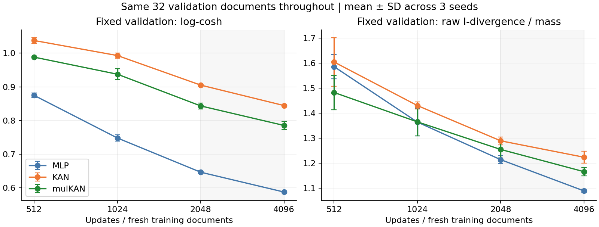
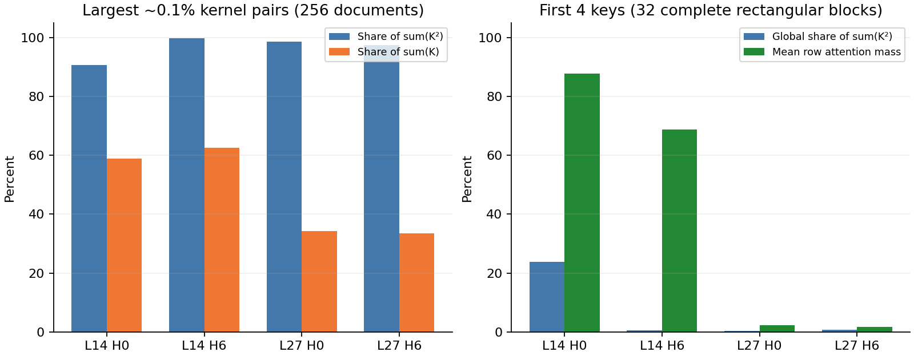

有训练尚不充分的证据，但现有日志不能把优化不足与表达能力不足完全分开。另一方面，“0.1% 贡献大部分平方能量”揭示的是目标风险的极端权重集中，不等于 attention 概率集中，也不能直接推断幂律或无穷方差。本次只读取已有数据和 checkpoint 做诊断，没有追加梯度训练或变更原实验。

**末段损失是否仍在下降**

必须比较同一个集合上的风险。旧日志的 `loss` 是当前一篇文档的一次 loss，不是固定训练集或移动平均；I-divergence 训练还省略了随目标变化的常数，跨文档的负数变化更不能作为收敛证据。下面使用全程固定的前 32 篇验证文档，模型均为 N=4096、小参数预算，先平均固定四个 head，再平均三个 seed：

| 训练目标 | 模型 | 2048步 | 4096步 | 下降比例 |
|---|---|---|---|---|
| logcosh | MLP | 0.6468 | 0.5880 | 9.1% |
| logcosh | KAN | 0.9053 | 0.8446 | 6.7% |
| logcosh | mulKAN | 0.8435 | 0.7855 | 6.9% |
| poisson | MLP | 1.2137 | 1.0887 | 10.3% |
| poisson | KAN | 1.2892 | 1.2236 | 5.1% |
| poisson | mulKAN | 1.2547 | 1.1657 | 7.1% |

后半程仍有 5.1%—10.3% 改善，不能把当前 checkpoint 当作已达到该结构的最佳逼近性能。准确说法是：存在优化尚未充分完成的迹象；已有稀疏记录没有证明最终几十步还在下降，也没有证明延长训练一定继续改善。学习率已按 4096 步从 0.002 退火至 0.0002，曲线变缓可能包含学习率效应。

不同 head 并不一致。例如 KAN 的 (14,0) 验证 I-divergence/质量从 0.8031 升至 0.8198，而其他 head 带动整体下降。两倍参数的 log-cosh 实验也降低了训练和测试风险：MLP 测试 0.5858→0.5348，KAN 0.8360→0.7698，mulKAN 0.7794→0.6992。这说明容量或参数化可能有影响，但优化轨迹也改变了，不能单独据此识别纯容量瓶颈。

当前结论只能是固定数据、步数、学习率、参数预算下的比较，不能写成充分收敛后的结构上限比较。训练不足与尾部泛化差距可以同时存在；前轮 mulKAN 的 I-divergence 训练 raw NMSE=0.8021、测试=0.8845，不因整体曲线仍下降就消失。

**0.1% 平方能量的精确定义**

每个 head 在 256 篇内部测试文档上有 N=131,072 个配对样本。将 K 从大到小排序，取最大的 ceil(0.001N)=132 个，记集合 S。所报数字是

$$C_2=\frac{\sum_{i\in S}K_i^2}{\sum_{i=1}^{N}K_i^2}.$$

“能量”只是平方和的线性代数术语。C2 不是概率质量，不是模型误差，不表示 99.9% 的 token 没有作用。与之并列的 C1=Σ_SK/ΣK 是整个样本池中的未归一化 kernel 质量占比，也不等于逐 query 归一化后再平均的 attention 概率。

| head | 最大0.1%的平方和占比 C2 | 同一集合的质量占比 C1 | 单个最大样本的平方和占比 | 平方权重集中度数量 |
|---|---|---|---|---|
| [14, 0] | 90.74% | 58.97% | 33.69% | 6.49 |
| [14, 6] | 99.69% | 62.47% | 62.84% | 2.15 |
| [27, 0] | 98.56% | 34.30% | 53.93% | 3.01 |
| [27, 6] | 97.49% | 33.58% | 46.63% | 4.11 |

最后一列是 (ΣK²)²/ΣK⁴，即归一化平方权重的 inverse participation ratio；它量化权重集中度，**不是统计上独立样本的数量**。例如 (14,6) 单个样本就占 62.84% 的平方和，前三个占约 98.11%。因此该经验平方风险很容易被少量文档中的极端对主导，测试排名应同时看文档 bootstrap、其他语料及分层误差。

一个简单例子：若 99.9% 的 K=1，0.1% 的 K=100，那么 C2=10/(10+0.999)=90.92%；大值改成 600，C2=360/(360+0.999)=99.72%。指数函数只需将 logits 拉开 log(100)=4.61 或 log(600)=6.40，就能产生这种比例。这个现象不要求数值溢出，也不要求幂律分布或无穷二阶矩。真实有限权重 LLM 的 Q/K 有界结论仍适用。

**平方风险、乘性误差、attention 形状在强调什么**

令 δ_i=Khat_i/K_i−1，则

$$\operatorname{NMSE}=\sum_i w_i\delta_i^2,\qquad w_i=\frac{K_i^2}{\sum_jK_j^2}.$$

这是乘性误差的极不均匀加权平均。若普通 99.9% 样本全部拟合正确、仅将尾部预测成接近零，则 NMSE≈C2，可以达到 0.91—0.997。反过来只拟合尾部、把其余样本预测成接近零，也可能得到 NMSE≈1−C2。故 raw NMSE≈1 不意味着所有样本都没学会，较低 raw NMSE 也不意味着多数样本拟合良好。目标能量与误差占比理论上不同；本次追加推断确认，各模型确实主要在尾部留下平方误差，见下表。

令 r=log(Khat/K)，三个目标可以统一写成

$$L_{\rm square}=K^2(e^r-1)^2,\quad L_I=K(e^r-1-r),\quad L_{\rm lc}=\log\cosh r.$$

在小误差附近，它们分别近似 K²r²、Kr²/2、r²/2。对 log-prediction 的梯度分别为 2K²e^r(e^r−1)、K(e^r−1)、tanh r。尤其严重低估时 r→−∞，平方损失对 log-prediction 的梯度趋零，而 I-divergence 的梯度趋 −K。该公式说明 I-divergence 对严重低估的大值具有不同的纠正机制；实际参数梯度还乘以网络 Jacobian，不能据此保证优化必然成功。

训练仍直接拟合原始正 kernel；使用 log-ratio 计算损失或对公共幅度校准，不会把训练标签改成归一化 attention。给每行 K 乘一个仅依赖 query 的公共因子，会改变原始 kernel 风险，而在 linear attention 分母中抵消。这说明两个目标本来就不完全相同，而不是要求放弃用户指定的原始 kernel 拟合目标。

**大值来自哪里：位置、范数和方向**

在 (14,0)/(14,6) 的 132 个最大配对样本中，分别有 107/91 个来自 key 位置 0；但这两个 head 最大的三个平方能量样本均来自非开头位置。例如 (14,6) 最大样本来自内部测试文档 234，q位置1022、k位置260，logit=7.1698。其 q范数42.42（全体均值23.42）、k范数18.48（均值18.41）、余弦0.103（全体均值−0.227）。不能只检查 key 范数，也不能只检查最初几个 token。

第 27 层两个 head 的大值位置更分散，其尾部平均余弦分别约 0.362/0.461，全体约 0.045/0.161。不同 head 同时涉及范数和方向变化，观察到相关性并不等于已经识别因果机制。

在前 32 篇文档的完整合法 512×512 块上，比较前四个 key：

| head | 前4个key的全局平方和占比 | 前4个key的平均逐行attention质量 |
|---|---|---|
| [14, 0] | 23.89% | 87.68% |
| [14, 6] | 0.61% | 68.77% |
| [27, 0] | 0.26% | 2.25% |
| [27, 6] | 0.72% | 1.71% |

第14层的前几个 key 吸收了大量平均 attention 概率，这与 [StreamingLLM 的 attention sink 观察](https://arxiv.org/abs/2309.17453)相符；但该局部证据不是完整的机制证明，不能把全部 raw-kernel 尾部等同于 sink。上述概率只对前512个 key 归一化、query为后512位置，属于本实验的矩形块诊断，不是完整 causal 上下文的概率。

**已训练模型如何拟合尾部**

下表都是三个 seed 的平均。中位预测比例是先在各 seed 的尾部取 Khat/K 中位数，再平均；尾部总质量比例是 Σ_SKhat/Σ_SK。

| 损失 | 模型 | head | 尾部占总平方误差 | 尾部中位预测比例 | 尾部总质量预测比例 |
|---|---|---|---|---|---|
| logcosh | MLP | [14, 0] | 91.06% | 0.0163 | 0.0108 |
| logcosh | MLP | [14, 6] | 99.71% | 0.0153 | 0.0041 |
| logcosh | MLP | [27, 0] | 99.02% | 0.0377 | 0.0302 |
| logcosh | MLP | [27, 6] | 98.27% | 0.0458 | 0.0315 |
| logcosh | KAN | [14, 0] | 91.95% | 0.0598 | 0.0351 |
| logcosh | KAN | [14, 6] | 99.81% | 0.1861 | 0.0385 |
| logcosh | KAN | [27, 0] | 98.93% | 0.0242 | 0.0224 |
| logcosh | KAN | [27, 6] | 98.05% | 0.0271 | 0.0193 |
| logcosh | mulKAN | [14, 0] | 95.93% | 0.5578 | 0.3769 |
| logcosh | mulKAN | [14, 6] | 99.90% | 0.7152 | 0.1620 |
| logcosh | mulKAN | [27, 0] | 99.11% | 0.0664 | 0.0583 |
| logcosh | mulKAN | [27, 6] | 98.40% | 0.0759 | 0.0667 |
| poisson | MLP | [14, 0] | 98.18% | 0.9204 | 0.5750 |
| poisson | MLP | [14, 6] | 99.89% | 0.8228 | 0.1880 |
| poisson | MLP | [27, 0] | 98.09% | 0.2190 | 0.2030 |
| poisson | MLP | [27, 6] | 96.42% | 0.2330 | 0.2384 |
| poisson | KAN | [14, 0] | 98.40% | 0.9109 | 0.5518 |
| poisson | KAN | [14, 6] | 99.89% | 0.7413 | 0.1567 |
| poisson | KAN | [27, 0] | 98.23% | 0.1935 | 0.1836 |
| poisson | KAN | [27, 6] | 96.51% | 0.2287 | 0.2355 |
| poisson | mulKAN | [14, 0] | 98.46% | 0.8970 | 0.5589 |
| poisson | mulKAN | [14, 6] | 99.89% | 0.8041 | 0.1683 |
| poisson | mulKAN | [27, 0] | 97.71% | 0.1874 | 0.2292 |
| poisson | mulKAN | [27, 6] | 95.68% | 0.2370 | 0.2774 |

例如 MLP/log-cosh 的尾部中位预测只达到目标的约1.5%—4.6%，普通样本的稳健拟合确实伴随大值低估。MLP/I-divergence 在 (14,0)/(14,6) 的中位比例提升到约92%/82%，但 (14,6) 的尾部总质量只恢复约19%，意味着最极端的少数点仍明显低估。不能仅靠一个中位数判断尾部已学好。

**对下一轮训练和理论的启发**

1. 先测收敛再判断结构。保留原始 kernel 标签和每个训练对只用一次的约束，使用更长的新数据流，增加记录频率，固定验证/训练探针，保存中间 checkpoint；学习率先保持可学习区间，再退火。用共同的更长学习率计划比较4096/8192/16384步，而不是分别在每个终点提前退火。另做固定唯一数据对数、改变batch大小的步数对照，可帮助区分数据覆盖与更新步数，但batch变化本身仍有混杂。单遍约束下无法把固定数据重复优化作为完全等价的消融。
2. 关注尾部覆盖，而不只计 token 总数。按训练数据中确定的 logit 桶、key位置、q/k范数和方向模式做分层监控，比较普通样本、sink样本和非sink极端样本。若训练时改变采样分布，应记录采样概率；目标保持原风险时使用正确的逆概率权重，并保留均匀探索。直接按每行完整 QK 找top-k会增加训练成本，不能宣称推断时免费得到该信息。
3. I-divergence 可作为主要损失，辅以较小的 log-cosh 项来兼顾普通样本。权重使用训练集公共尺度校准、验证集选择，不进行逐行标签归一化。这个组合尚未在本次运行中测试，不能宣称已经优于现方案。不要把删去极端值后的好指标当作解决原始 kernel 拟合问题。
4. 正特征可考虑单侧幅度与形状分解：Khat=a(q)b(k)Σ_r f_r(q)g_r(k)，a,b>0。这仍可吸收到m维特征中，保持 linear attention 结构；query幅度在分母抵消，但若目标是原始K，训练时仍需恢复正确幅度。该分解可能改善优化条件，不构成 KAN 特有的表达优势，也未在此次诊断中验证。
5. 理论应说明风险对数据分布的重新加权：raw NMSE 对相对误差使用 dP2/dP=K²/E[K²]；质量归一化 I-divergence 使用 dP1/dP=K/E[K]。在普通样本、sink和非sink极端样本的混合分布上分析谱与逼近，比无条件套用一个高斯更贴近当前证据。经验权重高度集中会使矩估计与经验谱对稀有事件敏感；需要跨文档稳定性和总体泛化分析。

这些结果不证明 m=64 已达到秩瓶颈，也不证明没有秩瓶颈。逐测试块的有符号 SVD oracle 不受正因子、跨文档共享函数、训练估计和优化的限制，不能用其低残差宣布当前网络只缺训练步数。对 KAN/mulKAN 的有价值主张，应是相同预算下更快或更稳地学会这些结构，而不是仅凭通用逼近或乘法节点断言更强。

诊断输入为 `../fits/`、`../data/`；代码为 `../diagnose_convergence_tail.py`、`../summarize_diagnostics.py`；所有数值保存在 `convergence_tail.json`。原始45个训练 checkpoint 未修改。
